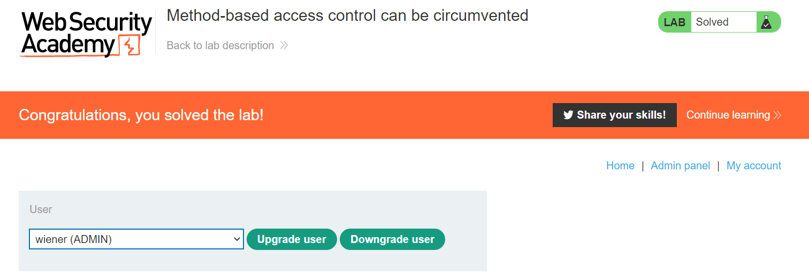

# **Access Control**

## **Lab:** Method-based access control can be circumvented

**Goal:** Log in using the credentials wiener:peter and exploit the flawed access controls to promote yourself to become an administrator.

**The lab provide:** An Admin's credential: administrator:admin

**Solution:** 

1.  Firstly, we will use an admin's account to promote Carlos in order to observe how website work

Looking at the result, we can see that the administrator sent a POST request to the endpoint `/admin-roles` with parameter username=carlos and action=upgrade. The server responded with a status code of 302 and the carlos's role has been upgraded 

If we try to use the same request but as a wiener, we still get a 302 status code but we get a message like below

2.  Let go back to the admin's account, downgrade user carlos then upgrade again. However, we will use a GET request with the same parameter instead of a POST request

We still upgrade suscessfully

3.  The server may implement access controls based on HTTP Request Method. Therefore, the server may prevent normal user from doing a POST request to the endpoint `/admin-roles` but not a GET request. If we user wiener's account and to a GET request to that endpoint with parameters, we may be able to upgrade user wiener to admin and that is actually a case here.

