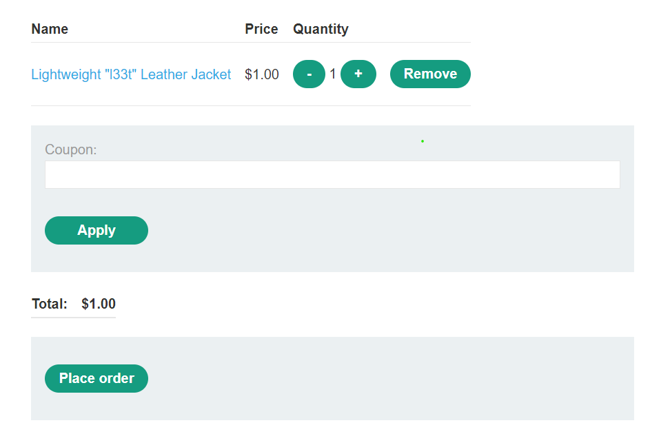
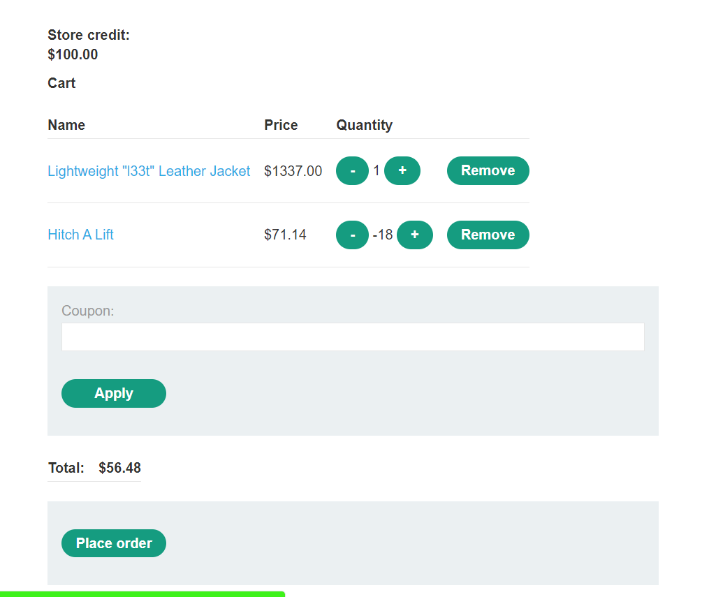

# **Business Logic Vulnerabilities**

## **Excessive trust in client-side controls**

### **Lab 1: Excessive trust in client-side controls**

**Solution:** Change the price of the product in the POST request to the `/cart` endpoint via the price parameter in that request body. It will add the product with a changed price to the cart. Finally, complete the order

Solution script: [Lab1.py](./Lab1.py)

## **Failing to handle unconventional input**

**Solution:** Add the leather jacket normally. Then add another product with a suitable negative quantity (by changing the quantity parameter in the POST request to endpoint `/cart`) to reduce the total price to less than 100$. Finally, complete the order

Solution script: [Lab2.py](./Lab2.py)