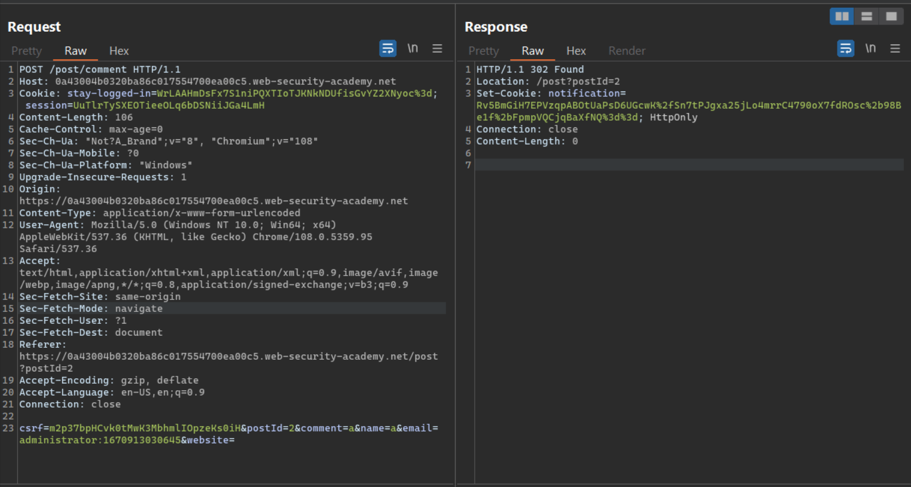

# **Business Logic Vulnerabilities**

## **Lab:** Authentication bypass via encryption oracle

**Goal:** Log in as administrator and delete Carlos.

**The lab provide:** A credential wiener:peter

**Solution:**

1.  When login as wiener with option 'Stay logged in', we have a stay-logged-in cookie with value is encrypted as 'WrLAAHmDsFx7S1niPQXTIoTJKNkNDUfisGvYZ2XNyoc%3d'

2.  In the comment section, when we try enter an invalid email address, the browser responds with a message: 'Invalid email address: '

Look at the request history, we can see that if we submit comment that way, the server will create a notification cookie with encrypted value.

When go back to the blog page with a notification cookie, the server may decrypt that notification cookie as 'Invalid email address: ' then return that message to client.

3.  The server may use the same encryption/decryption algorithm for both cookie. We verify that by setting notification cookie as 'WrLAAHmDsFx7S1niPQXTIoTJKNkNDUfisGvYZ2XNyoc%3d' which is a value of the stay-logged-in cookie. Instead of the usual message: 'Invalid email address: ', the server return with a format 'wiener:a number'

Therefore, we can conclude that the server uses the same encryption/decryption algorithm for both cookie and the stay-logged-in cookie format is 'username:a number'. If we change the stay-logged-in cookie to the encrypted version of 
'administrator:a number', we may be able to log in as administrator

4.  In the comment section, set the email as 'administrator:a number' and send the request. We get the ciphertext.

Then, we do a GET request to the /post endpoint with that cookie, we get a message: 'Invalid email address:  administrator:a number'

This may indicate that the server will add the 23-character 'Invalid email address: ' before whatever the value in the email parameter and then encrypted it

5.  Send the ciphertext to Burp Decoder. Firstly, the ciphertext has some URL Encoded character (%3d%3d), so we try URL Decode it.

Secondly, the new ciphertext looks like it is base64 encoded, so we will base64 decode it

Observe the new output, we can see that it has 64 bytes which is divisible by 16. The server may use some kind of block cipher algorithm for the plaintext

In conclusion, the encryption process may be: block cipher algorithm -> Base64 Encoded-> URL Encoded.

6.  With block cipher algorithm, the common size of the block is 16 bytes. The plaintext is divided into blocks with 16 bytes each. Then the server will encrypted each block with secret key. Therefore, we will try set the email as 'bbbbbbbbbadministrator:a number' (9 letter b). With this value, the message will be 'Invalid email address: bbbbbbbbbadministrator:a number' which will be devided as 'Invalid email ad' 'dress: bbbbbbbbb', some blocks of the message 'administrator:number'. Therefore, if we remove the first 16 bytes of the new ciphertext, the remaining may be a ciphertext of the plaintext 'administrator:a number'

Send the request with the email as 'bbbbbbbbbadministrator:a number'

Get the ciphertext of 'administrator:a number' 

7.  Set the stay-logged-in cookie to that new ciphertext, delete the session cookie and make a request, we successfully become and admin

