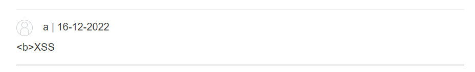
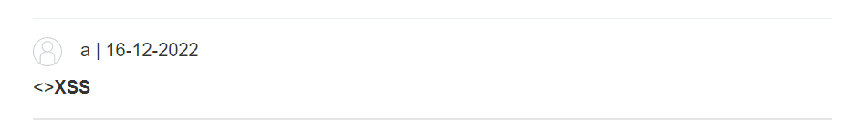

<div align='center'>

# **Clickjacking**

</div>

## **Lab:** Stored DOM XSS

**Goal:** This lab demonstrates a stored DOM vulnerability in the blog comment functionality. To solve this lab, exploit this vulnerability to call the alert() function

**Solution:**

1.  We try to discover XSS vulnerabilities by comment `<b>XSS</b>`. The vulnerabilities is not appear, however, the `</b>` is gone.



2.  Viewing the page source code, we see that the browser use this script [loadCommentsWithVulnerableEscapeHtml.js](./script.js) to handle the comment data

In the script, it has a function named "escapeHTML" to prevent XSS.

```javascript
function escapeHTML(html) {
        return html.replace('<', '&lt;').replace('>', '&gt;');
}
```

The function encode the `<` to `&lt`, and `>` to `&gt` which make `<`,`>` become normal characters. However, this implementation only remove the first apperance of the `<` and `>` character. That is why when we comment as `<b>XSS</b>`, the `</b>` is gone. We try `<><b>XSS</b>` and it works as expected



3.  Comment the post as `<>` will solve the lab because the img tag will cause and erroe which will trigger `alert()` function.  