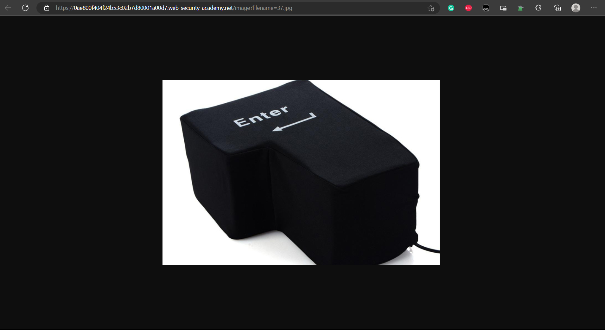
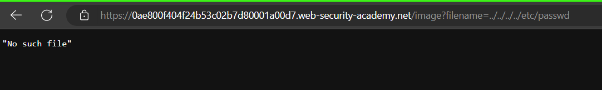
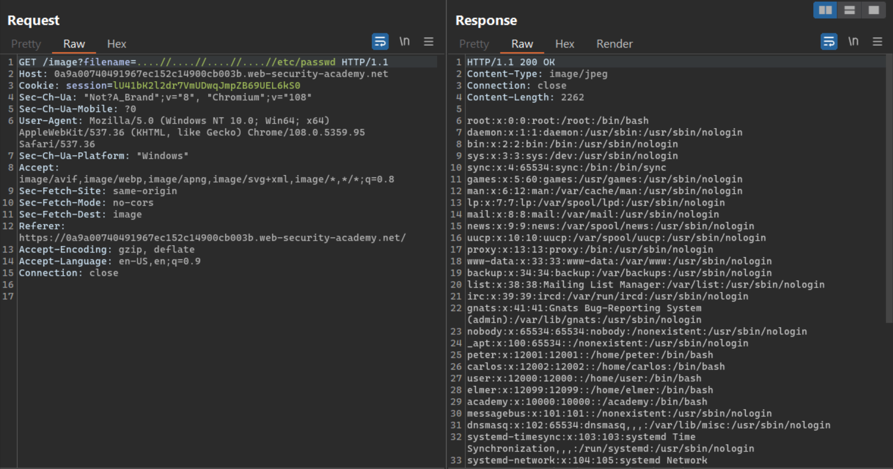

# **Directory Traversal**

## **Lab:** File path traversal, traversal sequences stripped non-recursively

**Goal:** retrieve the contents of the /etc/passwd file.

**Solution:** 

1.  We discover the endpoint `/image` with parameter `filename`. This endpoint display the image based on `filename`

2.  This endpoint maybe vulnerable to Directory Traversal, so we try filename = `../../../../etc/passwd` and it does not work

3.  Based on the title of the lab, the server removed the string `../` if it appear in the filename parameter, so the filename will actually is `/etc/passwd` which is not exist (because the path of the file maybe `/var/www/html/image/etc/passwd`). However, if the server remove the string once (non-recursively), we can try filename = `....//....//....//....//etc/passwd`, so if that is the case, the filename will be `../../../../etc/passwd` and we will be able to read the content of this file

**Solution script:** [Lab3.py](./Lab3.py)
