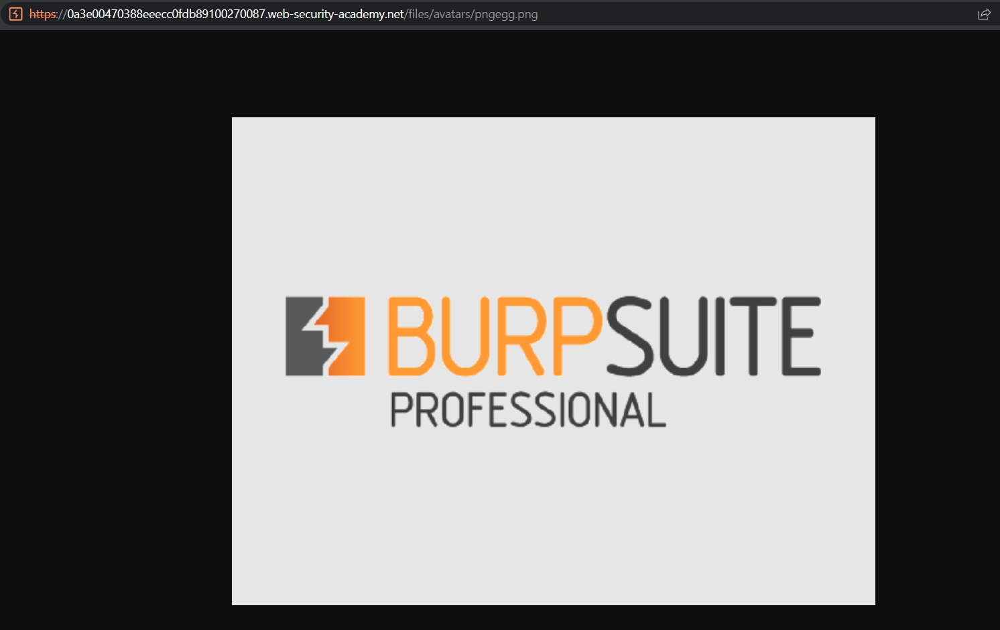
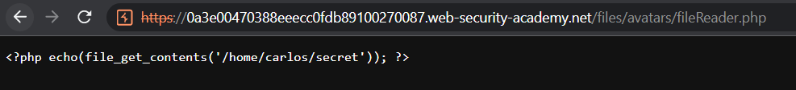

<div align='center'>

# **File Upload Vulnerabilities**

</div>

## **Lab:** Web shell upload via path traversal

**Goal:** Read the file /home/carlos/secret

**The lab provide:** A credential wiener:peter

**Solution:**

1.  Log in as wiener and we see that this website allow us to update avatar by uploading image file


The image file is stored in the /files/avatars folder with filename remain unchanged.



2.  We will try to upload a malicious php file [expoit.php](./Payload/fileReader.php) with the content:

```php
<?php echo(file_get_contents('/home/carlos/secret')); ?>
```

The browser may try to execute this php code and return the content of `/home/carlos/secret` for us. However, the browser returns the content of php code as plaintext



3.  May be this directory is not configured to exceute PHP code. We will try to upload this php file into another directory (/files). Since the filename is unchanged, we try to modify a filename into `../exploit.php` in the request and then send it to the server. However, the server is aware of this vulnerbility and remove `../` in the filename


4.  We will URL Encode the `/` character into `%2f` in order to bypass that restriction. Modify a filename into `..%2fexploit.php` in the request and then send it to the server. The server URL decodes back into `/` and return the message as expected 


5.  The file is stored at /files folder. Navigate to /files/exploit.php to get a secret content.


