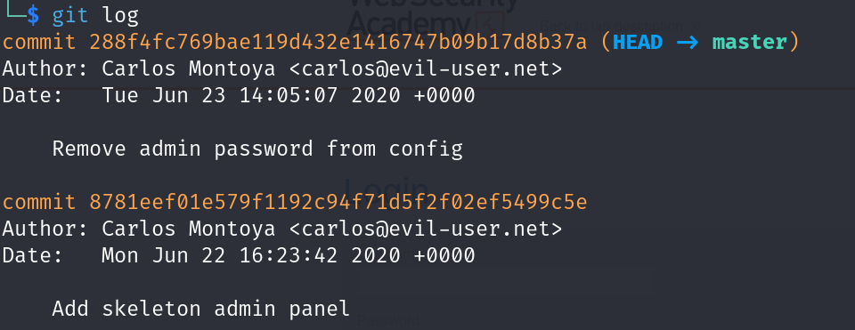

<div align='center'>

# **Information Disclosure**

</div>

## **Lab:** Information disclosure in version control history

**Goal:** Login as administrator and delete Carlos's account

**Solution:**

1.  Use gobuster to scan the website for common dicrectory and file by the command in Kali Linux

```zsh
gobuster dir -e -u your URL -w /usr/share/wordlists/dirb/common.txt
```

Looking at the result, we see an interesting dicrectory called .git


2.  Go to the /.git endpoint, we see that this look like a git repository


Download a whole dicrectory by using

```zsh
wget -rq your URL
```

3.  Using `git log`, we see that there are two commits, the interesting one is the one with the message 'Remove admin password from config'



4.  Using `git show` to see the changes that have been made, we see the line that look like an administrator's password


5.  Trying to login as administrator using that password, we log in sucessfully


6.  Delete Carlos's account to solve the lab


