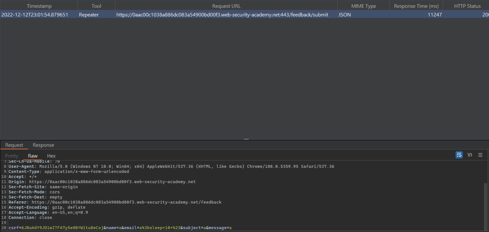
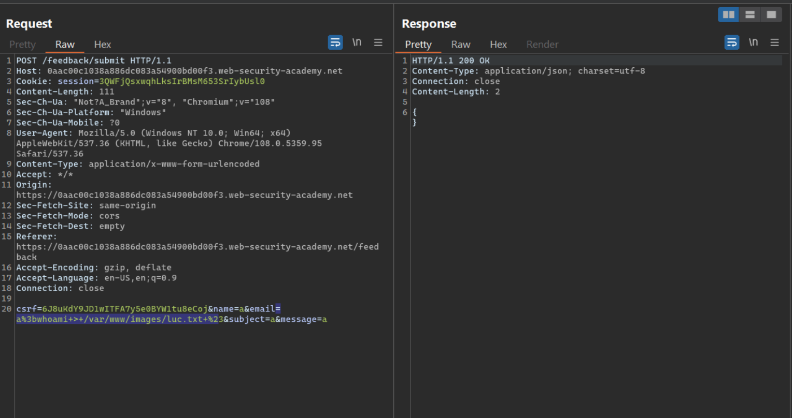
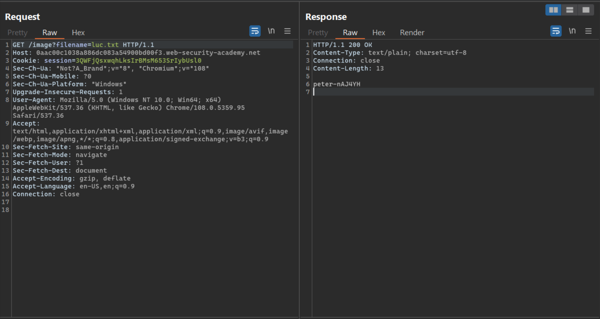

# **OS Comand Injection**

### **Lab 3: Blind OS command injection with output redirection**

**Goal:** Execute the whoami command and retrieve the output.

**The lab provide:** 
-   /var/www/images/ is a writable folder

**Solution:**

1.  In the /feedback endpoint, we will test the email parameter by making email = `a;sleep 10 #`. The application takes more than 10 second to respond. Therefore, this endpoint is vulnerable to Blind OS Command Injection

2.  With Blind OS Command Injection, we can exploit by redirecting the output of a command to another file using `>` operator. We will try email = `whoami > /var/www/images/luc.txt #`. This payload will execute the `whoami` command and save the output into a file named `luc.txt` at `/var/www/images`

3.  Visit endpoint /image?filename=luc.txt to solve the lab

**Solution script:** [Lab3.py](./Lab3.py)