

# **SQL Injection**

## **UNION attacks**

### **Lab:** SQL injection UNION attack, retrieving data from other tables

**Goal:** Login as administrator user

**The lab provide:** A table called user, with collums call username and password

**Solution:** 

1.    The website has endpoint /filter that has parameter `category `which filter items based on category. We try adding `'` after the value of the category parameter and getting error. This indicates that this website is vulnerable to SQL injection.

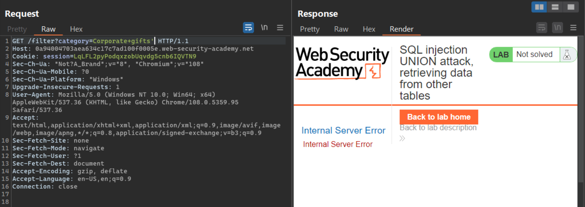

2.  Determine the number of coLumn that are being returned by the query:

We know that this website is vulnerable. We will use the query `order by` with number. We see that `' order by 2 -- -` still work but with `' order by 3 -- -`, the website return error. So the number of column is 2.

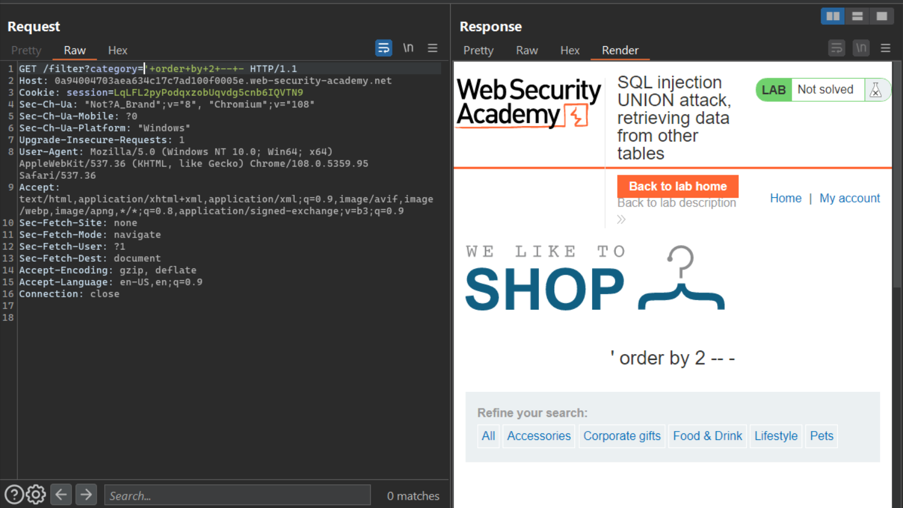

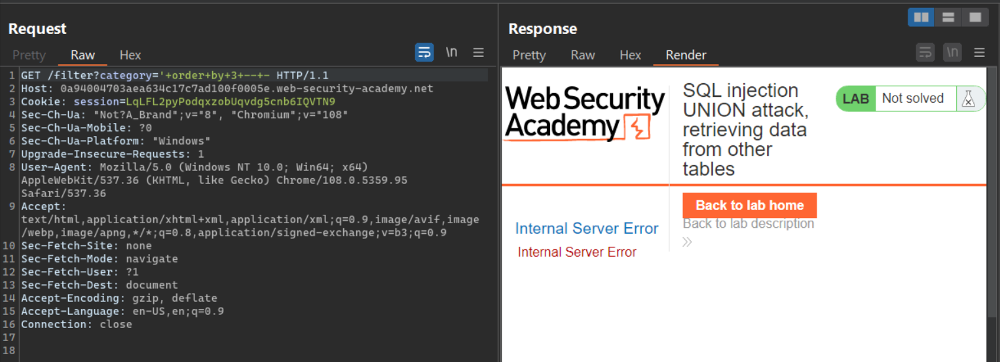

3.  Using the query `' Union select 'a', 'a' -- -`, we have verified that both column contain text data.

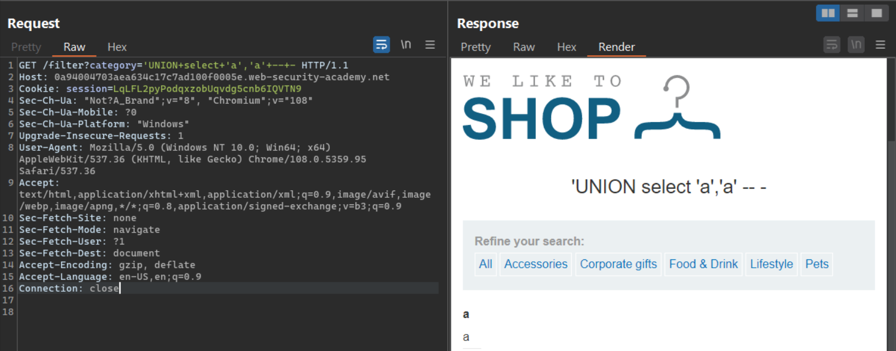

4.  Using the query `' Union select username,password from users where username='administrator' -- -`, we will get password of the user administrator.

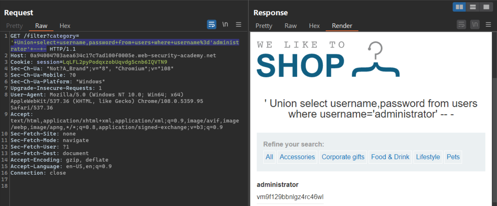

5.  Login as administrator to solve the lab

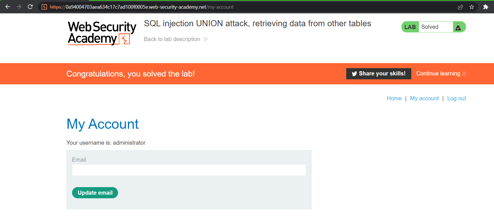

**Solution script:** [UNIONLab3.py](./UNIONLab3.py)

## **Examining the database**

### **Lab 9:** SQL injection attack, listing the database contents on non-Oracle databases

**Goal:** Login as administrator user

**The lab provide:** A table that holds usernames and passwords, so we need to find out the table name and the column name.

**Solution:**

1.    The website has endpoint /filter that has parameter `category `which filter items based on category. We try adding `'` after the value of the category parameter and getting error. This indicates that this website is vulnerable to SQL injection.

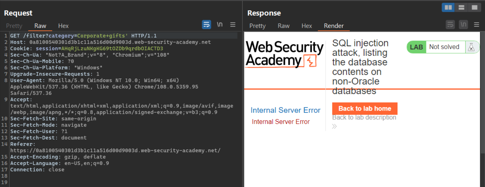

2.  Determine the number of coLumn that are being returned by the query:

We know that this website is vulnerable. We will use the query `order by` with number. We see that `' order by 2 -- -` still work but with `' order by 3 -- -`, the website return error. So the number of column is 2.

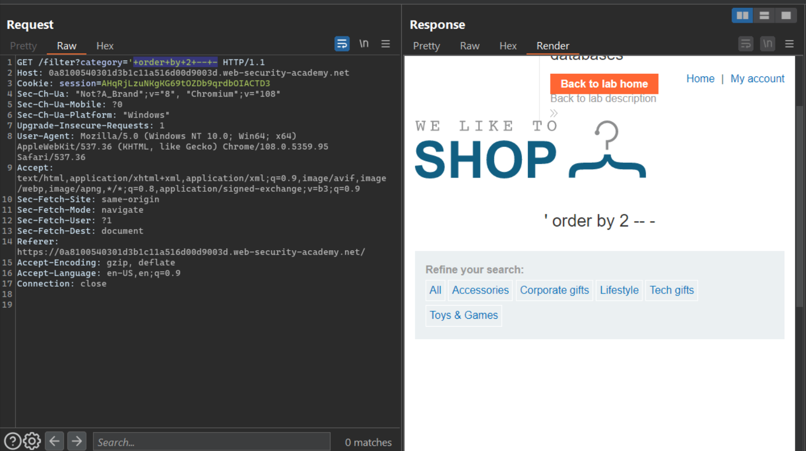

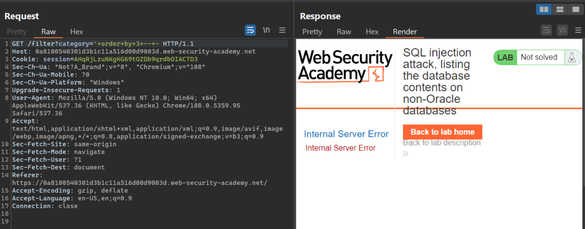

3.  Using the query `' Union select 'a', 'a' -- -`, we have verified that both column contain text data.

4.  Determine the database version

Using queries from different databases, we see that the database is postgreSQL (query: Union select version(), null -- -)

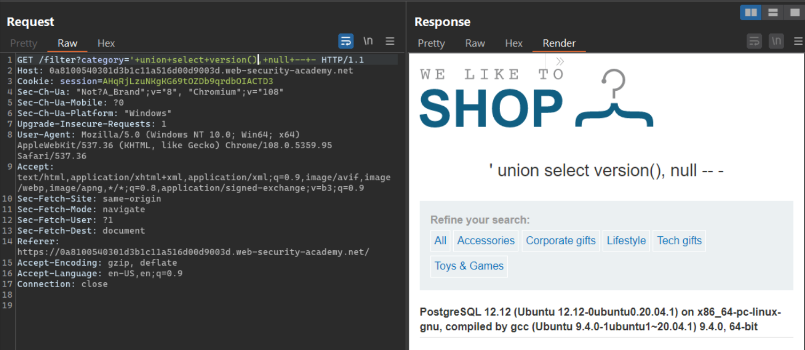

5.  With PostgreSQL, use the query `' union select table_name, null from information_schema.tables -- -`. Looking at the result, we see that there is a table named users_muqwsh

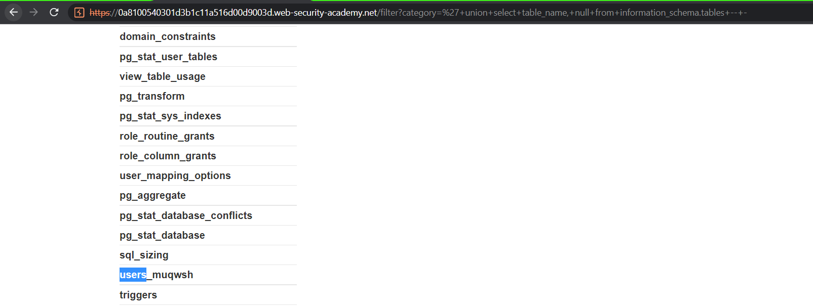

6.  Use the query `' union select column_name, null from information_schema.columns where table_name='users_muqwsh' -- -` to get the columns name. Looking at the result, we see that this table has 2 columns: username_vdoeck and password_bnwwyr

7.  Using the query `' Union select username_vdoeck,password_bnwwyr from users_muqwsh where username_vdoeck='administrator' -- -`, we will get password of the user administrator.

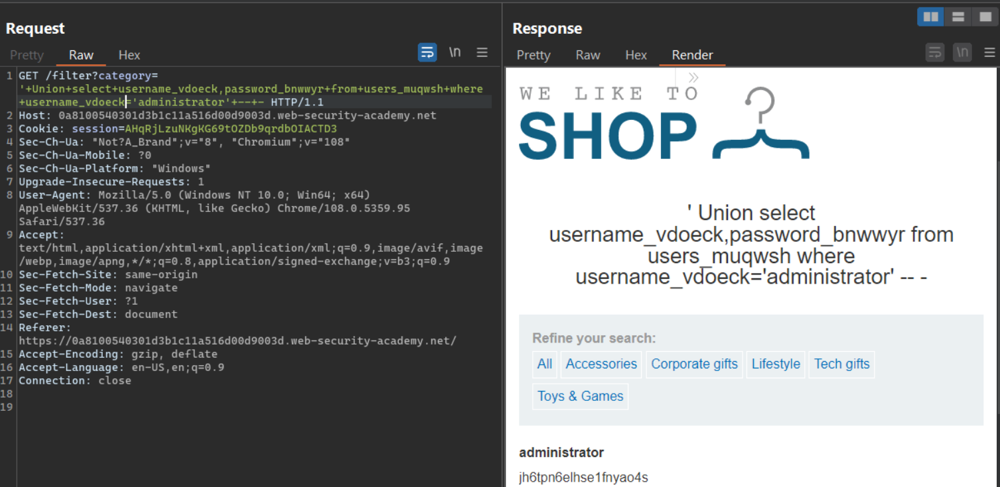

8.  Login as administrator to solve the lab

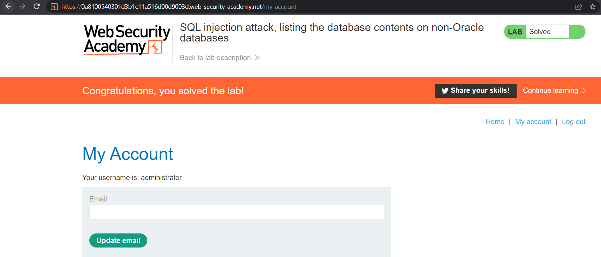

**Solution script:** [ExaminingLab3.py](./ExaminingLab3.py)

## **Blind SQL Injection**

### **Lab:** Blind SQL injection with conditional responses

**Goal:** Login as administrator user

**The lab provide:** The application uses a tracking cookie for analytics, and performs an SQL query containing the value of the submitted cookie. The database contains a different table called users, with columns called username and password

**Solution:** 

1.  Since this website use SQL for tracking cookie. We will try modify it. We will call the initial value of the tracking cookie 'xyz' for demonstration purpose. Setting the tracking cookie to `xyz'`, we see that the 'Welcome back!' message is not appeared. This is not a normal behavior of this website. Therefore, the tracking cookie may be vulnerable to SQL injection.

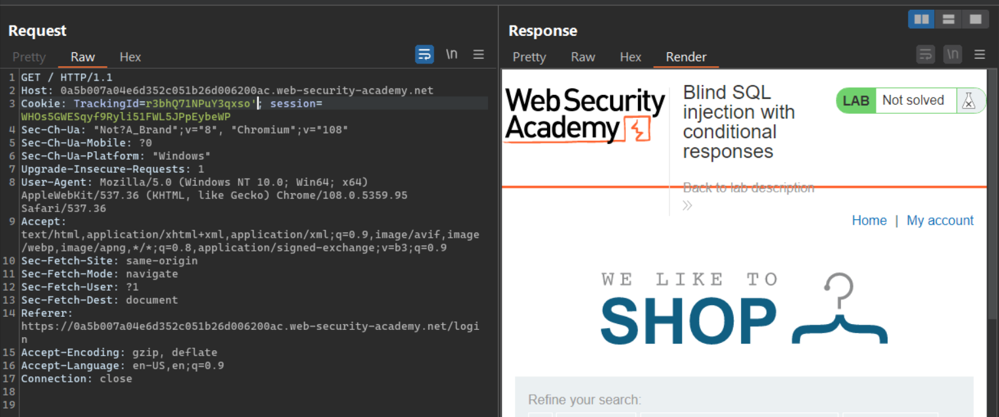

2.  Exploring further by setting the tracking cookie to `xyz' and '1'='1' -- -` and `xyz' and '1'='2' -- -`. We see that with the `'1' = '1'`, the 'Welcome back!' message is appeared while `'1' = '2'`, the 'Welcome back!' message is not appeared. Therefore, we are certain that the tracking cookie is vulnerable to SQL injection, specifically Blind SQL Injection with conditional responses. If tracking id exsit, the 'Welcome back!' message is appeared. If tracking id does not exsit, the 'Welcome back!' message is not appeared.

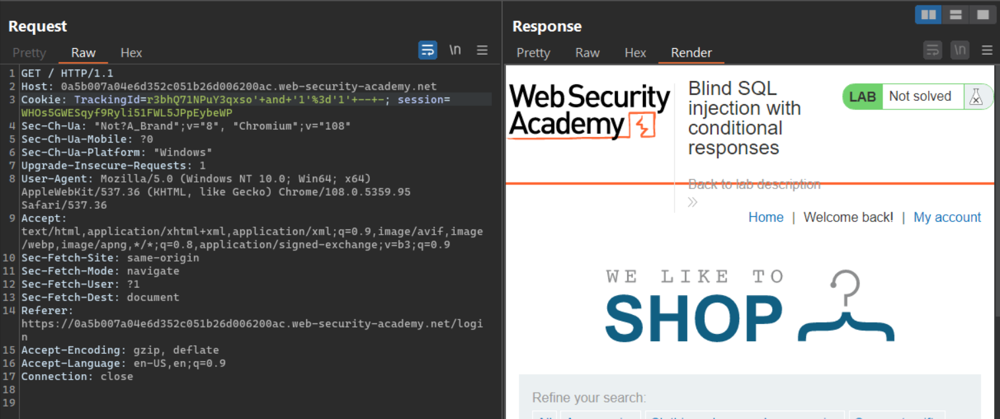

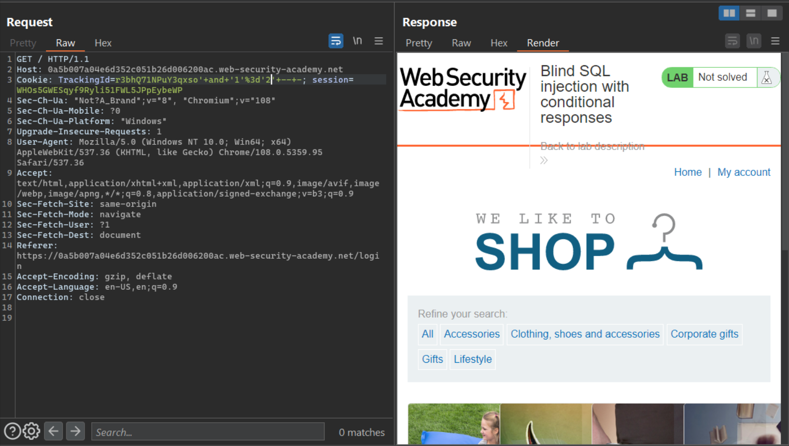

3.  Confirm that there is a table named users by setting the tracking cookie to `xyz' and (select 'l' from users LIMIT 1)='l' -- -`. the 'Welcome back!' message is appeared

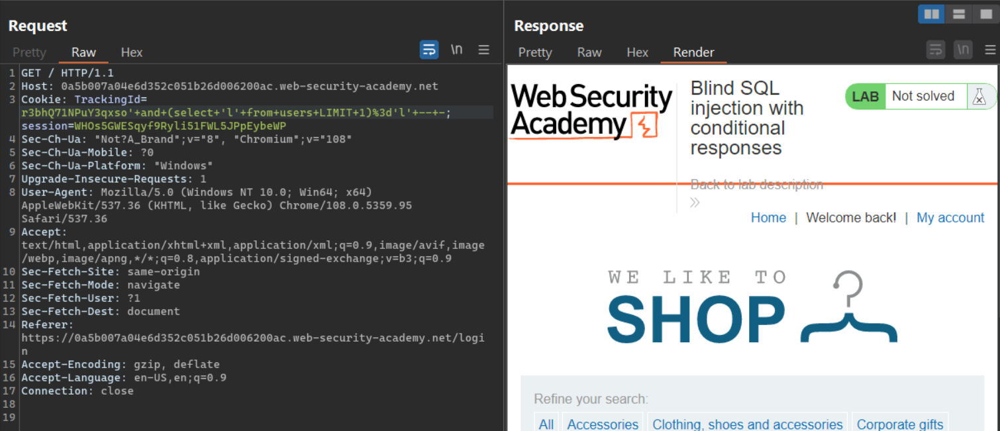

4.  Confirm that there is a user named administrator by setting the tracking cookie to `xyz' and (select 'l' from users where username='administrator' LIMIT 1)='l' -- -`. the 'Welcome back!' message is appeared

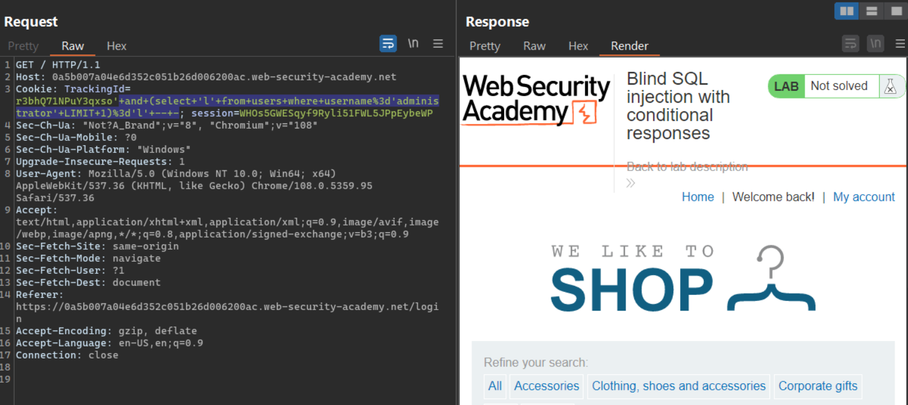

5.  We will brute force for the length of the password by setting the tracking cookie to `xyz' and (select length(password) from users where username='administrator' LIMIT 1)=1 -- -`, then `... LIMIT 1)=2 -- -` and so on. Eventually, we get the length of the password is 20

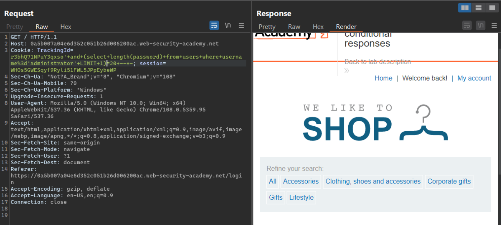

6.  We will bruteforce for the password using the burp intruder

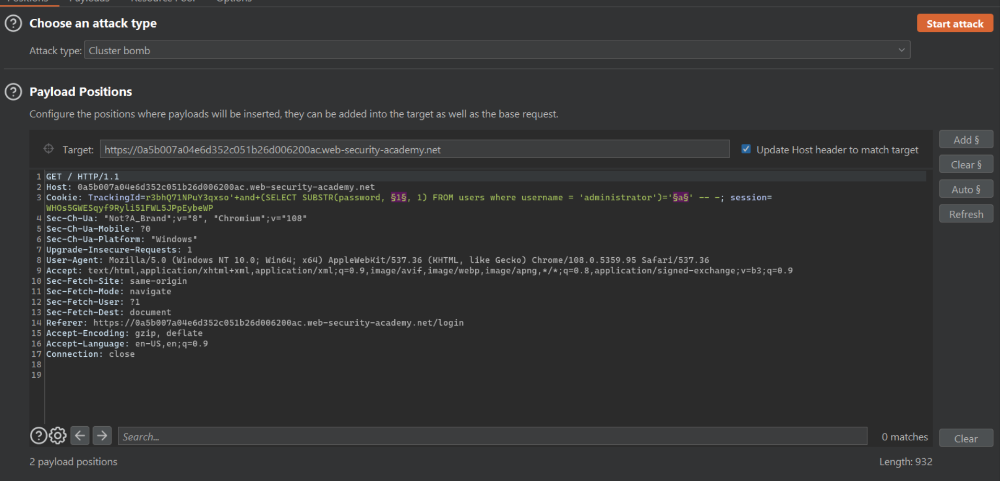

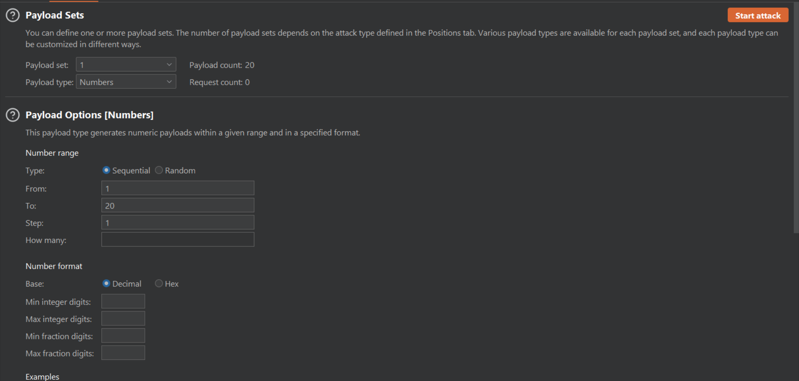

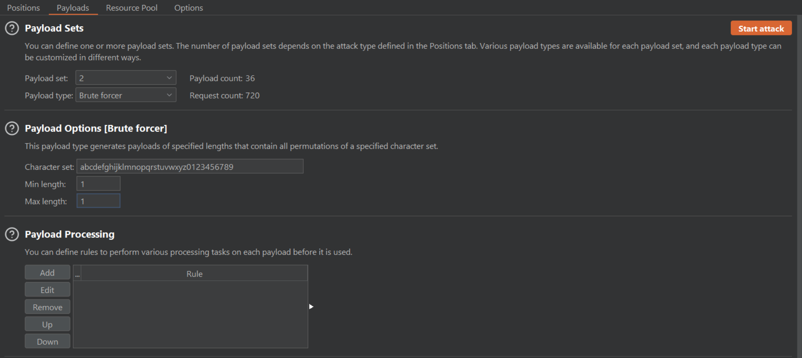

After bruteforcing, we get the password of the administrator based on the length of the response

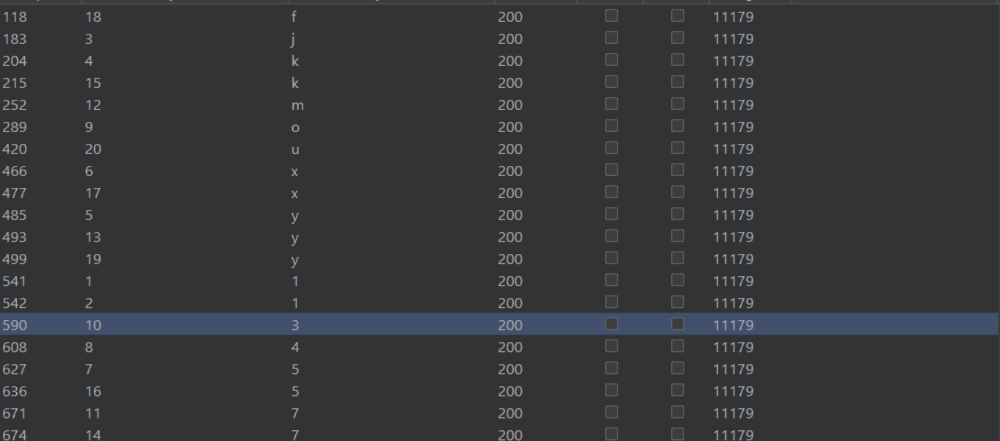

After reordering, the password is: 11jkyx54o37my7k5xfyu

7\.  Login as administrator to solve the lab

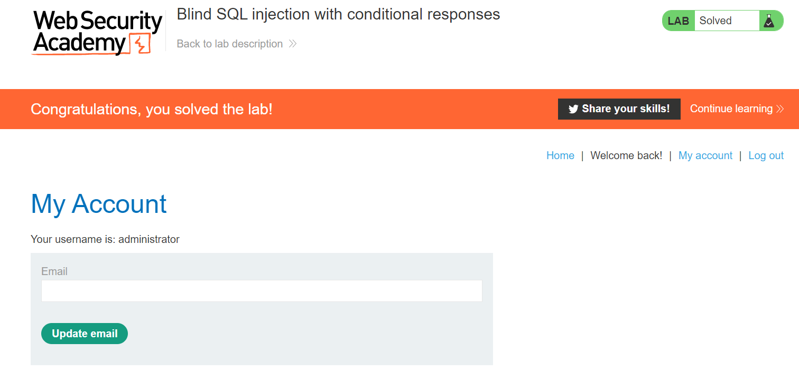

**Solution script:** [BlindLab1.py](./BlindLab1.py)