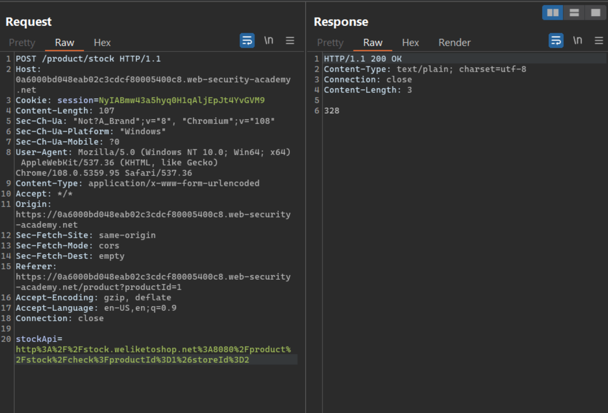
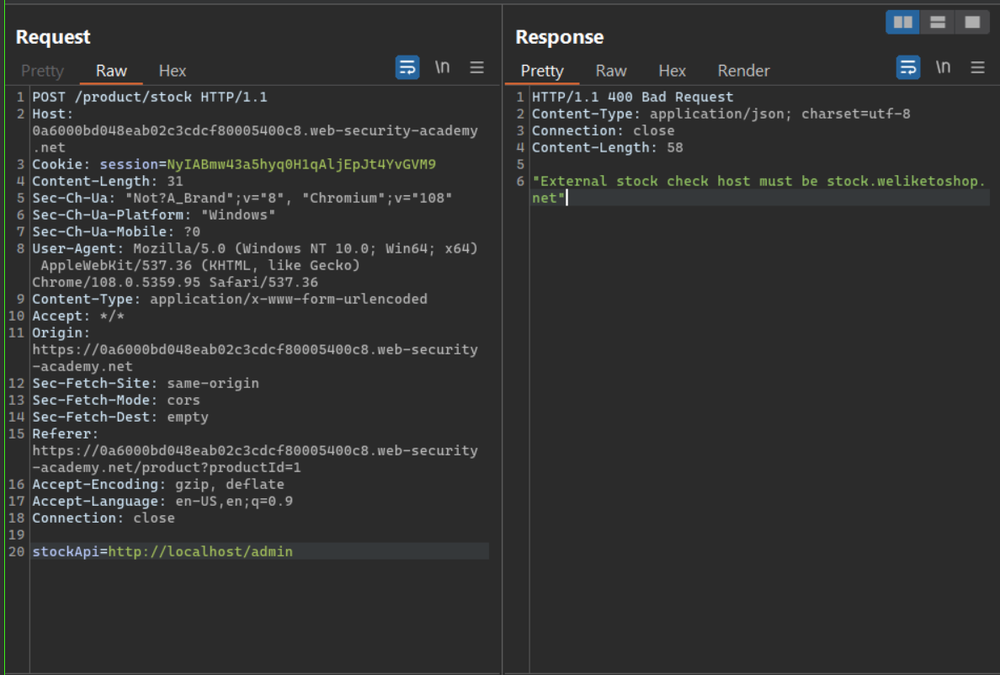
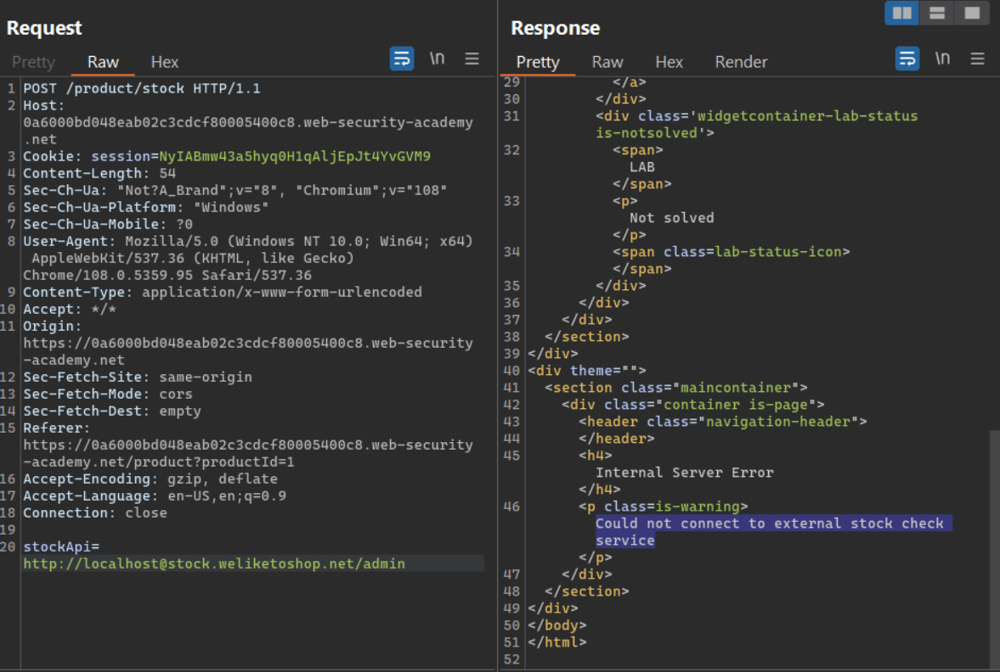
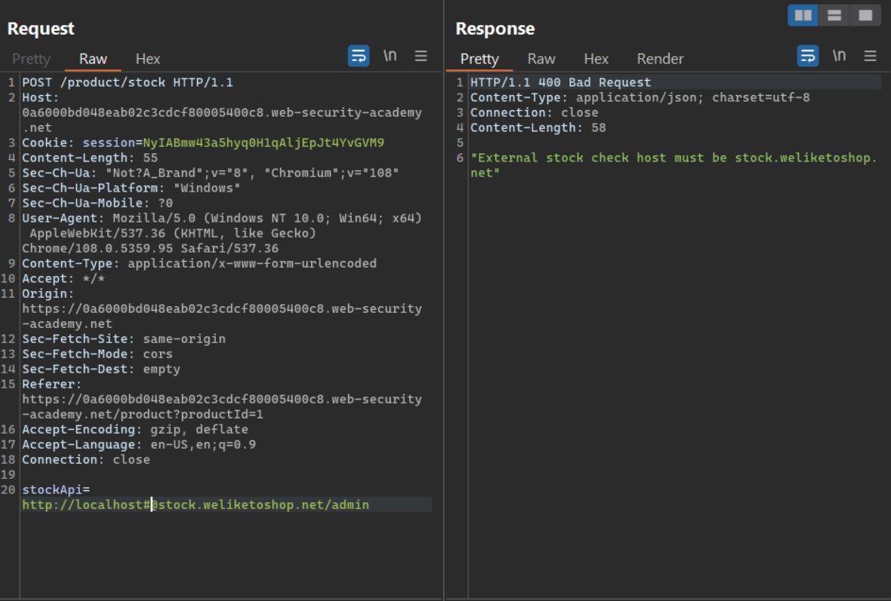
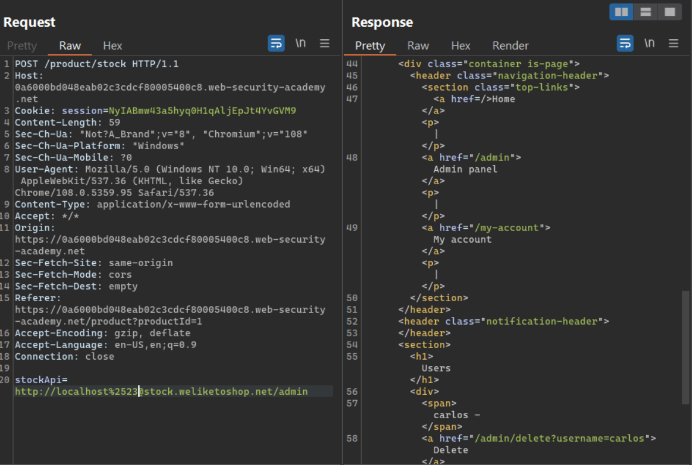
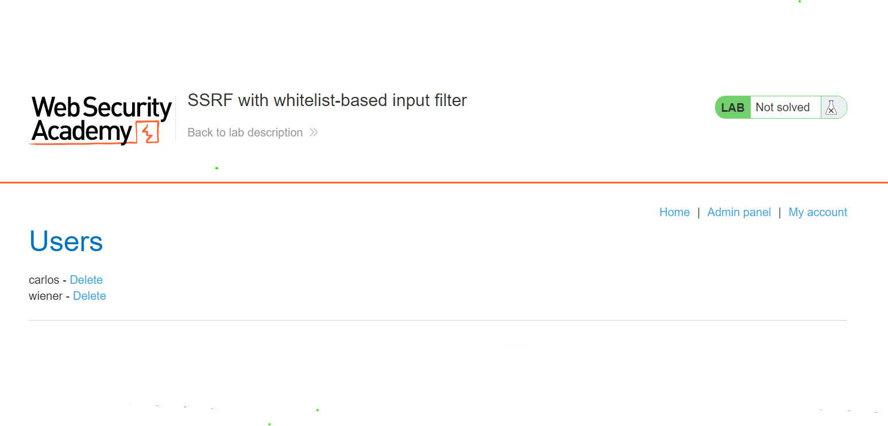
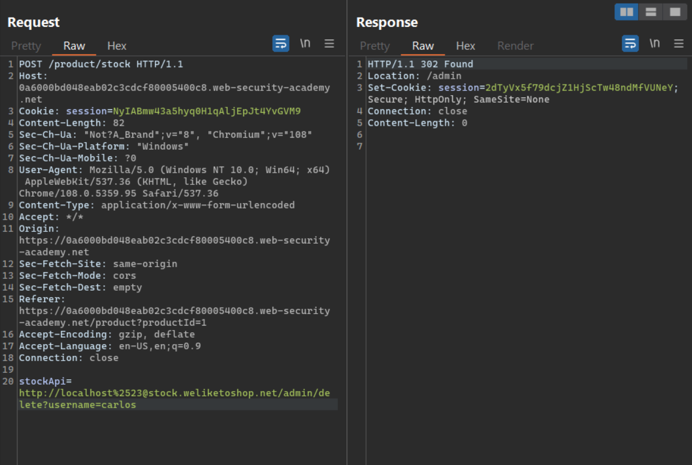

# **SSRF**

## **Lab:** SSRF with whitelist-based input filter

**Goal:** Change the stock check URL to access the admin interface at http://localhost/admin and delete the user carlos  

**Solution:**

1.  When we "check stock", a POST request is sent to endpoint `/product/stock` with parameter stockApi as `http://stock.weliketoshop.net:8080/product/stock/check?productId=1&storeId=2` (After URL Decoding)

If we change the stockApi to `http://localhost/admin`, the server respond with a message: External stock check host must be stock.weliketoshop.net

2.  Maybe the server is only check the hostname of the URL. Trying to change the stockApi to `http://localhost@stock.weliketoshop.net/admin`, the server return 500 status code with the message: Could not connect to external stock check service. Look like we are able to bypass the check, the server is just not able to connect to our stockApi.

3.  We will add `#` right after localhost (`#` indicates a URL Fragment) like `http://localhost#@stock.weliketoshop.net/admin`. The server rejects this URL because the URL is effectively as `http://localhost/admin` before the whitelist check

4.  If we double URL Encode the `#` character as `%2523`, we maybe able to bypass the whitelist check and then server will URL decode it as `http://localhost#@stock.weliketoshop.net/admin`. We have access to the admin panel

5.  Change the stockApi to `http://localhost#@stock.weliketoshop.net/admin/delete?username=carlos` to delete carlos user.

